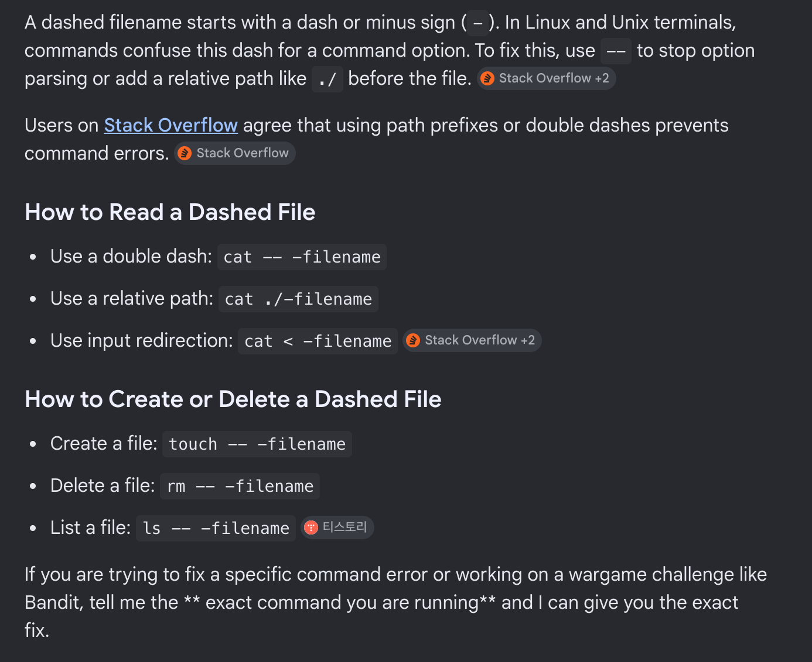
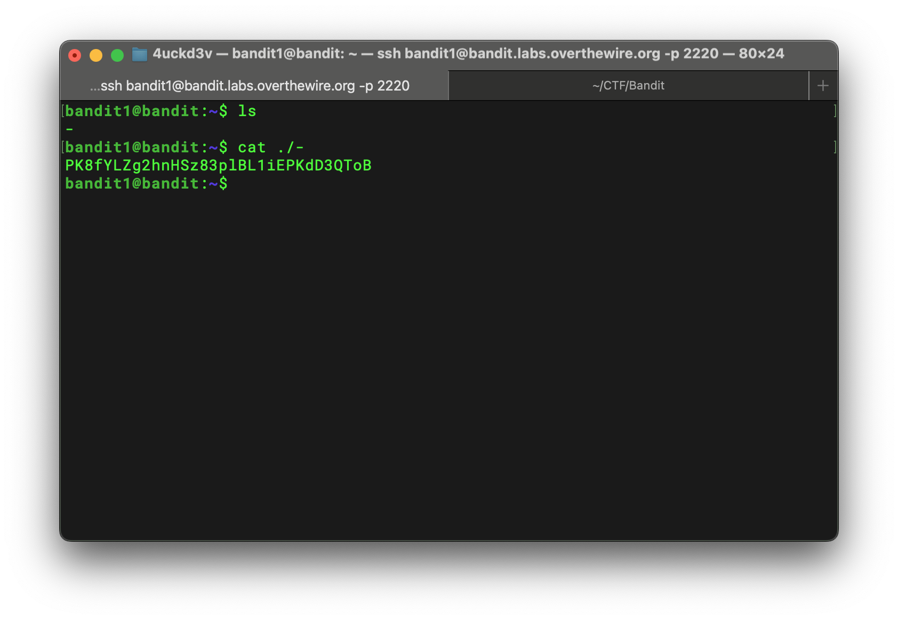

## Bandit Level 1 → 2 Writeup

> The password for the next level is stored in a file called `-`, located in the home directory.

List all files in long format:

```bash
ls -la
```

I found a file named `-`, so my first attempt was:

```bash
cat -
```

However, nothing was printed, and it felt like the command had not finished running. At first, I thought the file might be empty. After checking the **Helpful Reading Material** section, I noticed the hint about dashed filenames.



The problem is that `cat` interprets `-` as standard input instead of a filename. To avoid this, I tried specifying the file with a relative path:

```bash
cat ./-
```

This time, the command printed the password successfully.



Password for the next level:

```text
PK8fYLZg2hnHSz83plBL1iEPKdD3QToB
```
