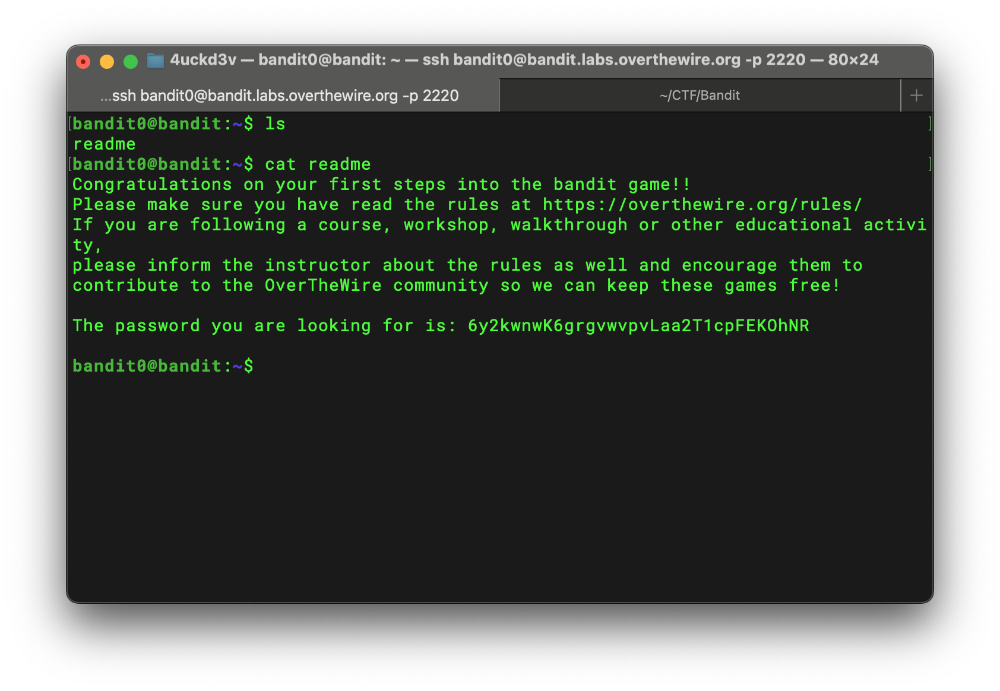

# Bandit Level 0 → 1 Writeup

## Goal

> Retrieve the contents of the `readme` file located in the home directory of the SSH server.

## Solution

Connect to the server with password `bandit0`:

```bash
ssh bandit0@bandit.labs.overthewire.org -p 2220
```

List all files in long format:

```bash
ls -la
```

The output shows a file named `readme`, so I displayed its contents with:

```bash
cat readme
```



## Password

```text
6y2kwnwK6grgvwvpvLaa2T1cpFEKOhNR
```
