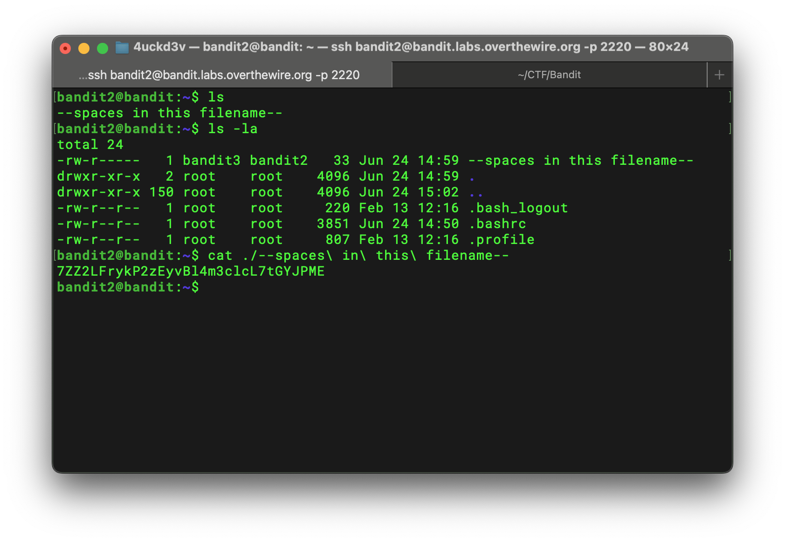

## Bandit Level 2 → 3 Writeup

> The password for the next level is stored in a file called `--spaces in this filename--`, located in the home directory.

List all files in long format:

```bash
ls -la
```

I found a file named `--spaces in this filename--`. Because the filename contains spaces, I used `\` (backslash) to escape each space. I also added `./` so that the filename would be treated as a relative path instead of an option. My command is:

```bash
cat ./--spaces\ in\ this\ filename--
```



Password for the next level:

```text
7ZZ2LFrykP2zEyvBl4m3clcL7tGYJPME
```
