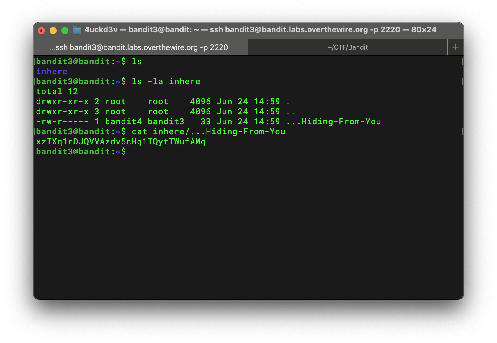

# Bandit Level 3 → 4 Writeup

## Goal

> The password for the next level is stored in a hidden file in the `inhere` directory.

## Analysis

Because the target file is hidden, I used the `-a` (all files) option with the `ls` command:

```bash
ls -la inhere
```

The output showed a hidden file named `...Hiding-From-You`.

## Solution

I retrieved its contents using `cat`:

```bash
cat inhere/...Hiding-From-You
```



## Password

```text
xzTXq1rDJQVVAzdv5cHq1TQytTWufAMq
```

## Key Takeaways

- Use the `-a` option with `ls` to include hidden files in the output.
- Hidden filenames on Unix-like systems begin with a dot (`.`).
