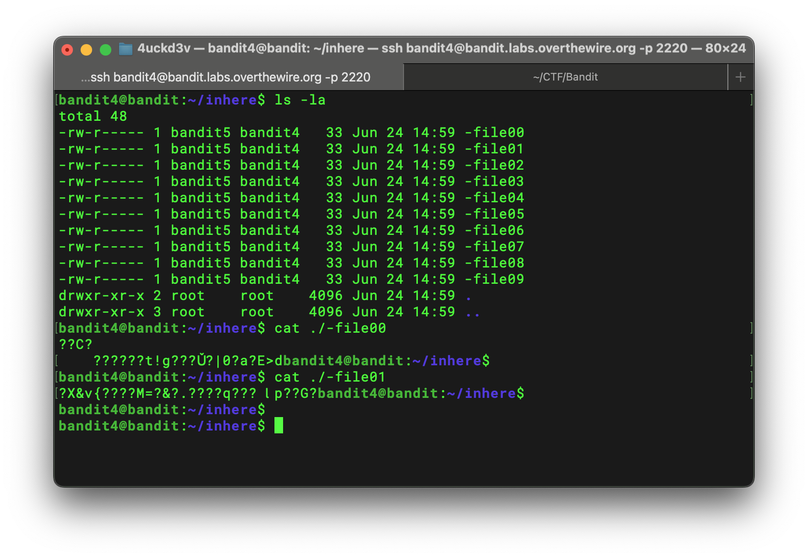
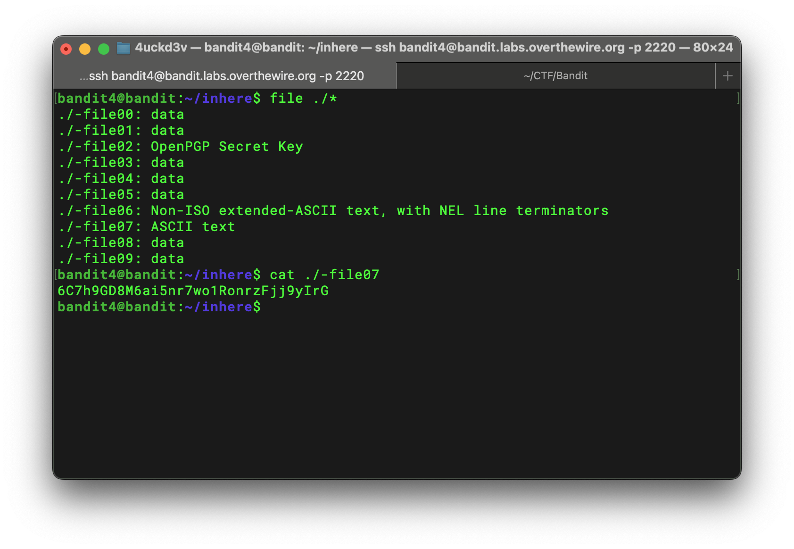

## Bandit Level 4 → 5 Writeup

> The password for the next level is stored in the only human-readable file in the `inhere` directory. Tip: if your terminal is messed up, try the “reset” command.

I listed all files in the `inhere` directory. I saw that there were many files, so I tried using `cat` on some of them to see what they contained.



Because the number of files was small, I could try reading them one by one to find the target content. However, this approach would not work well with a large number of files.

I noticed that some files contained characters that could not be displayed correctly in the terminal. Combined with the challenge description, I thought the target file should contain human-readable data.

On the Unix command line, the `file` command can determine and classify the actual data type of a file.

```bash
file ./*
```

The `*` character is called a wildcard. The shell expands `./*` to all non-hidden entries in the current directory, allowing `file` to inspect them at once.

The output showed that `./-file07` contained ASCII text, so I retrieved its contents using `cat`:

```bash
cat ./-file07
```



Password for the next level:

```text
6C7h9GD8M6ai5nr7wo1RonrzFjj9yIrG
```
