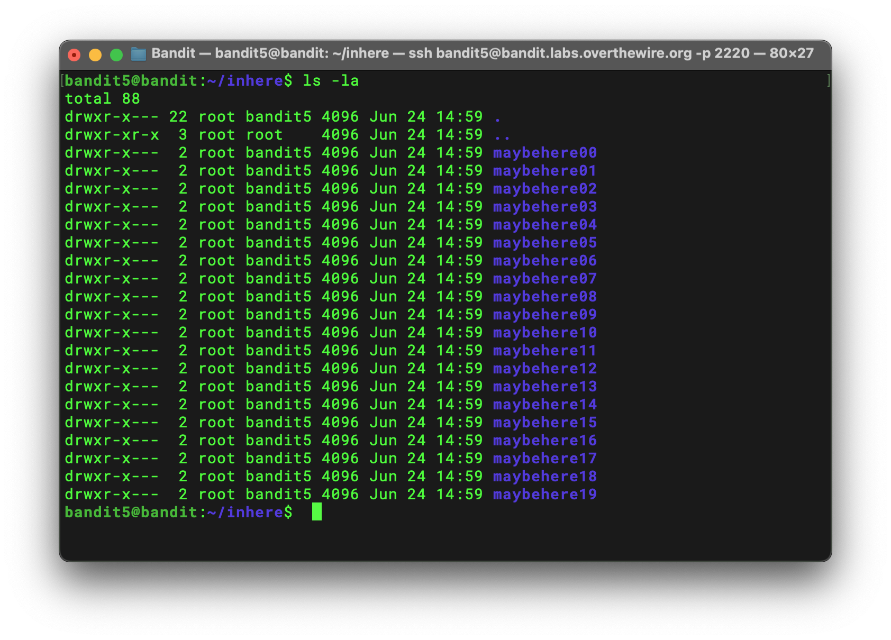
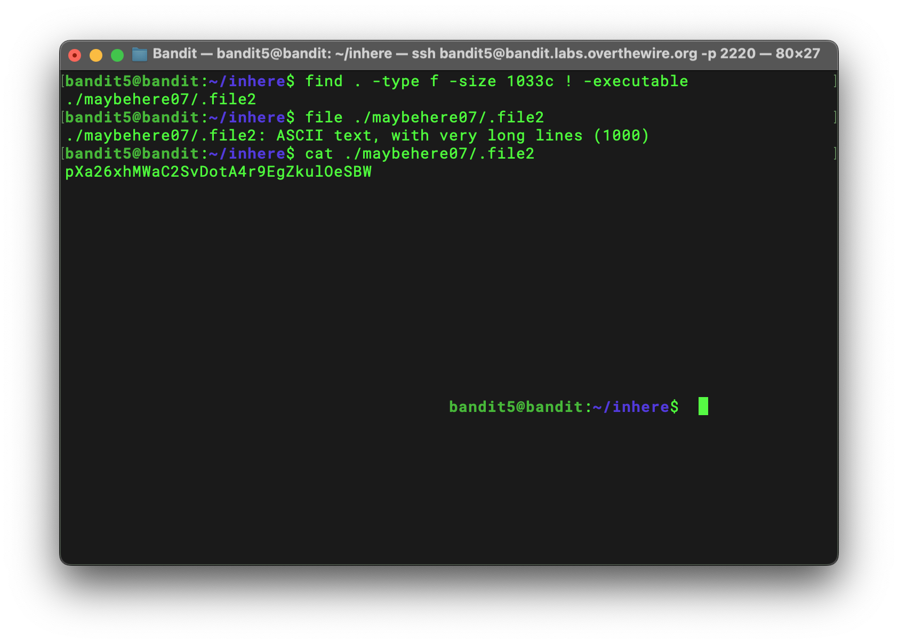

# Bandit Level 5 → 6 Writeup

## Goal

> The password for the next level is stored in a file somewhere under the `inhere` directory and has all of the following properties:
>
> - human-readable
> - 1033 bytes in size
> - not executable

## Solution

From the previous level, I knew that **human-readable** likely meant an `ASCII text` file. Therefore, I needed to check the other two conditions: a size of 1033 bytes and no executable permission.

One useful detail is that when we use the `ls` command with the `-l` option, the fifth column shows the size. For a regular file, this value is its size in bytes. For a directory, however, it is not the total size of everything inside that directory.



At first, I combined `ls` with `grep` to search for a line containing `1033`:

```bash
ls -la ./* | grep 1033
```

The pipe (`|`) sends the output of `ls` to `grep`, which keeps only the lines containing `1033`. The command returned:

```text
-rw-r-----  1 root bandit5 1033 Jun 24 14:59 .file2
```

This narrowed down the result, but it did not include the parent directory of `.file2`. Because there were many directories, I needed another way to search recursively while keeping the complete path, so I used `find` to filter the results by file type, exact size, and executable permission:

```bash
find . -type f -size 1033c ! -executable
```

Here, `-type f` limits the results to regular files, `-size 1033c` checks for exactly 1033 bytes, and `! -executable` excludes executable files. The command returned:

```text
./maybehere07/.file2
```

I then checked its file type:

```bash
file ./maybehere07/.file2
```

The result confirmed that it was human-readable:

```text
./maybehere07/.file2: ASCII text, with very long lines (1000)
```

Finally, I displayed the file contents to get the password for the next level:

```bash
cat ./maybehere07/.file2
```



## Password

```text
pXa26xhMWaC2SvDotA4r9EgZkulOeSBW
```
