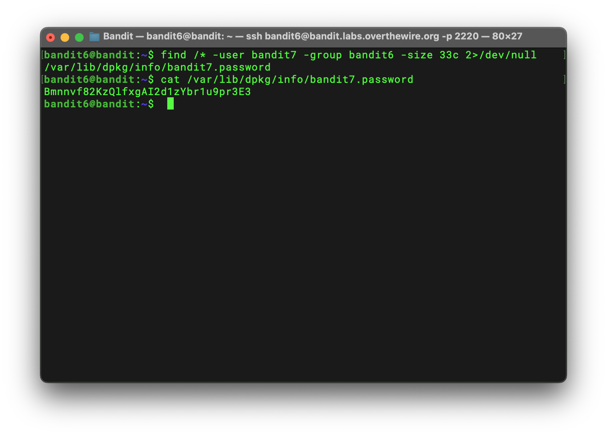

# Bandit Level 6 → 7 Writeup

## Goal

> The password for the next level is stored somewhere on the server and has all of the following properties:
>
> - owned by user bandit7
> - owned by group bandit6
> - 33 bytes in size

## Solution

I used `find` with the `-user`, `-group`, and `-size` options to search for a file that matched all three properties. Because the search covered many directories, `find` also printed permission errors to stderr. I used `2>/dev/null` to redirect stderr (`2`) to `/dev/null`, a special device that discards anything written to it.

```bash
find /* -user bandit7 -group bandit6 -size 33c 2>/dev/null
```

The command returned the following path:

```text
/var/lib/dpkg/info/bandit7.password
```

I then used `cat` to display the file contents and get the password for the next level:

```bash
cat /var/lib/dpkg/info/bandit7.password
```



## Password

```text
Bmnnvf82KzQlfxgAI2d1zYbr1u9pr3E3
```
