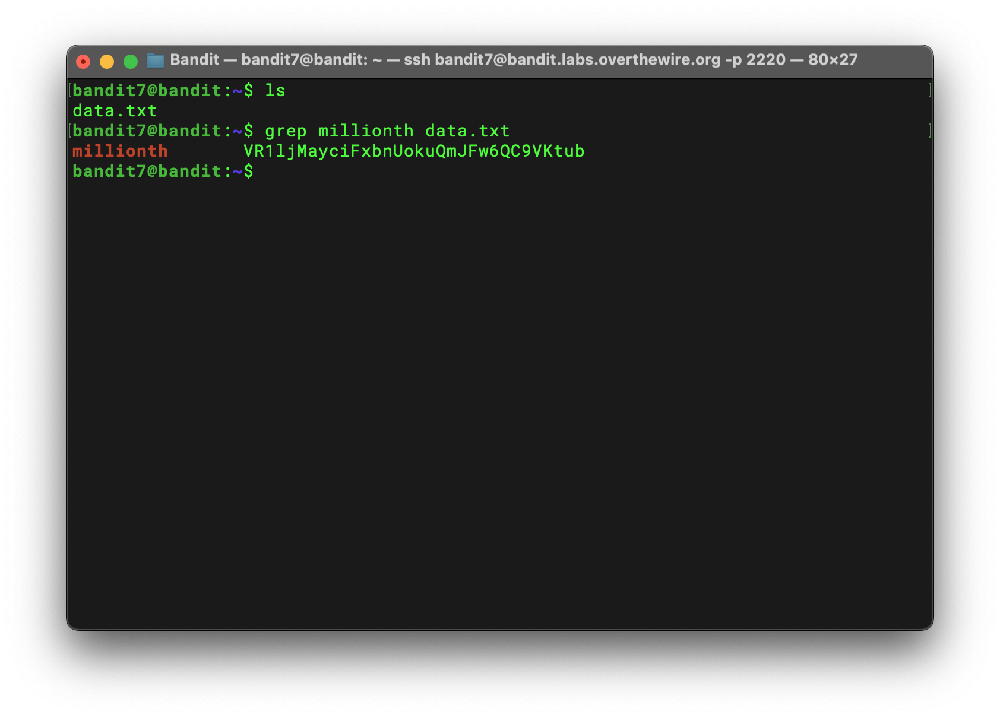

# Bandit Level 7 → 8 Writeup

## Goal

> The password for the next level is stored in the file data.txt next to the word `millionth`

## Solution

Use `grep` to print lines containing "millionth".

```bash
 grep millionth data.txt
```



## Password

```text
VR1ljMayciFxbnUokuQmJFw6QC9VKtub
```
