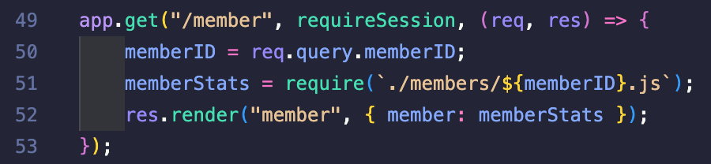
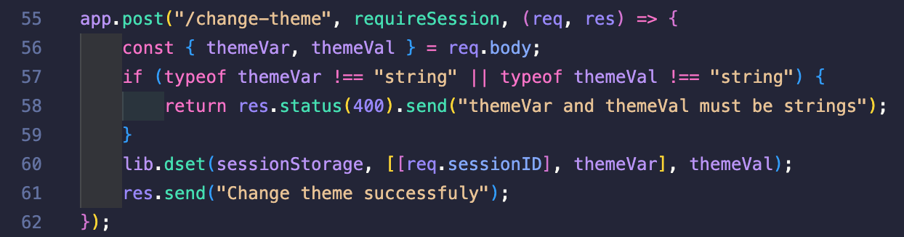
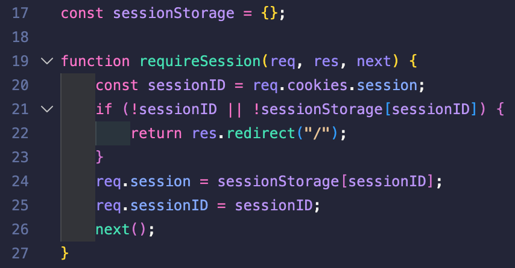
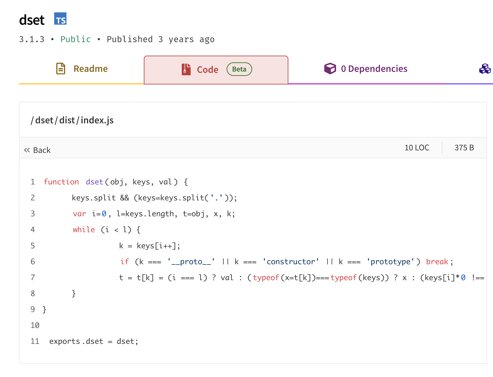
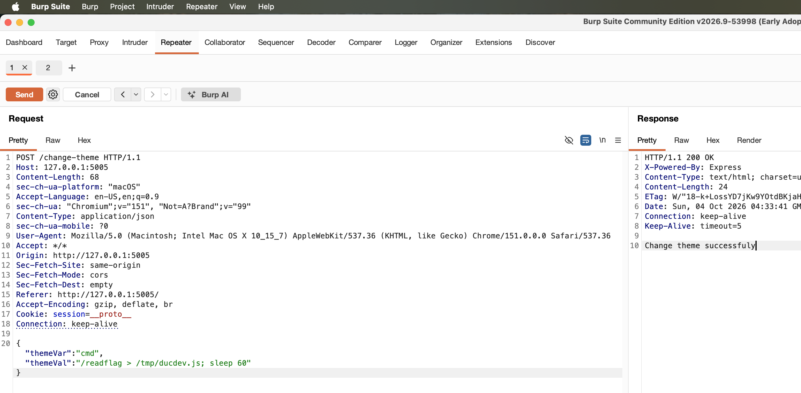
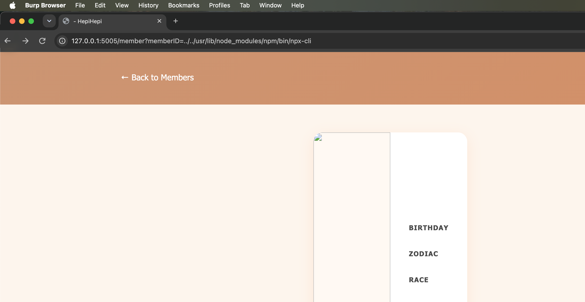

# ez_web

| Competition | aochinh26 training |
| ----------- | ------------------ |
| Category    | Web Exploitation   |

## Overview

> Chúng ta được cung cấp 1 trang fansite, chứa thông tin các thành viên của một nhóm, nhiệm vụ là RCE được trang web này để gọi được file binary `readflag`.

## Solution

Khi đọc qua codebase, ta thấy ứng dụng có hai chức năng đáng chú ý: xem thông tin thành viên thông qua route `/member` và thay đổi theme thông qua route `/change-theme`.



Đầu tiên là route `/member`. Đây là route dùng để hiển thị thông tin chi tiết của từng thành viên. Khi người dùng bấm vào một member ở trang chủ, client sẽ gửi request tới `/member` kèm theo query `memberID`.

Ở phía server, route này lấy `memberID` từ query rồi dùng giá trị đó để load file JavaScript tương ứng trong thư mục `members`.

Ý tưởng ban đầu của app là nếu `memberID=member1`, server sẽ require file: `./members/member1.js`

File này export thông tin của member, sau đó dữ liệu được truyền vào template `member.ejs` để render ra giao diện.

Tuy nhiên, vấn đề nằm ở chỗ `memberID` được lấy trực tiếp từ user input và đưa vào `require()` mà không có bước validate. Vì vậy, thay vì chỉ truyền các giá trị hợp lệ như `member1`, `member2`, ta có thể truyền path traversal để escape khỏi thư mục `members`.

Ví dụ:

```http
GET /member?memberID=../../tmp/malicious
```

Khi đó server sẽ gọi:

```js
require("./members/../../tmp/malicious.js");
```

Điều này khiến route `/member` không chỉ load các file member hợp lệ trong thư mục members, mà còn có thể bị lợi dụng để load những file .js khác trên filesystem.



Tiếp theo là route `/change-theme`. Đây là route dùng để thay đổi theme của ứng dụng. Client gửi lên hai giá trị `themeVar` và `themeVal`, sau đó server kiểm tra cả hai giá trị này có phải string hay không.

Nếu dữ liệu hợp lệ, server gọi `dset` để cập nhật dữ liệu theme vào session hiện tại:

```js
lib.dset(sessionStorage, [[req.sessionID], themeVar], themeVal);
```

Về mặt chức năng bình thường, app muốn lưu các setting liên quan đến theme theo từng session. Ví dụ, nếu session ID là `abc` và user muốn set một giá trị theme nào đó, dữ liệu sẽ được ghi vào object tương ứng với `sessionStorage["abc"]`.

Cả hai route trên đều đi qua một middleware là `requireSession`



Middleware này làm nhiệm vụ kiểm tra request hiện tại đã có session hợp lệ hay chưa. Nó lấy session ID từ cookie `session`, sau đó kiểm tra session ID này có tồn tại trong `sessionStorage` không:

```js
const sessionID = req.cookies.session;
if (!sessionID || !sessionStorage[sessionID]) {
  return res.redirect("/");
}
req.session = sessionStorage[sessionID];
req.sessionID = sessionID;
```

Nếu cookie không tồn tại, hoặc session ID không có trong `sessionStorage`, request sẽ bị redirect về `/`. Nếu session hợp lệ, middleware gán `req.session` và `req.sessionID` để route phía sau sử dụng.

### Prototype pollution

Prototype Pollution là một lỗ hổng trong JavaScript xảy ra khi attacker có thể ghi hoặc chỉnh sửa prototype của object, thường là `Object.prototype`.

Trong JavaScript, object có cơ chế kế thừa thông qua prototype chain. Khi truy cập một property không tồn tại trực tiếp trên object, JavaScript sẽ tiếp tục tìm property đó trên prototype của object. Vì hầu hết object thông thường đều kế thừa từ `Object.prototype`, nếu attacker pollute được prototype này thì
các object khác trong chương trình cũng có thể bị ảnh hưởng.

Ví dụ:

```js
Object.prototype.isAdmin = true;

const user = {};
console.log(user.isAdmin); // true
```

Ở ví dụ trên, object user không có property isAdmin, nhưng vẫn trả về true vì property này được kế thừa từ Object.prototype.

### CVE-2024-21529

Vì `dset` là một thư viện khá lạ nên mình kiểm tra thử version đang được sử dụng trong `package.json`:

```json
"dset": "3.1.3"
```

Search theo version này thì thấy `dset` từng có CVE liên quan đến Prototype Pollution là `CVE-2024-21529`. Lỗ hổng này ảnh hưởng các phiên bản `dset` trước `3.1.4`, trong khi challenge đang sử dụng `3.1.3`.

Theo advisory, lỗi nằm ở hàm `dset()` do quá trình xử lý input khi ghi deep property vào object chưa đủ chặt. Nếu attacker kiểm soát được path truyền vào `dset()`, có thể lợi dụng các key đặc biệt như `__proto__` để ghi dữ liệu vào prototype chain thay vì chỉ ghi vào object đích.

Mở tab Code trên trang npm của `dset@3.1.3`, ta thấy code của `dist/index.js` như sau:



Đoạn check quan trọng nằm ở đây:

```js
k = keys[i++];
if (k === "__proto__" || k === "constructor" || k === "prototype") break;
```

Nhìn qua thì có vẻ thư viện đã chặn các key nguy hiểm như `__proto__`, `constructor`, `prototype`. Tuy nhiên vấn đề nằm ở chỗ check này so sánh strict equality trực tiếp với `k`, trong khi `k` chưa bị ép kiểu về string.

Ở bản fix `3.1.4`, đoạn này được sửa từ:

```js
k = keys[i++];
```

thành:

```js
k = "" + keys[i++];
```

Tức là ép key về string trước khi kiểm tra key nguy hiểm. Điều này cho thấy bug của `3.1.3` nằm ở case key không phải string, nhưng khi được dùng làm property key thì JavaScript lại tự ép kiểu ngầm.

Quay lại route `/change-theme`, ta thấy tham số thứ hai truyền vào `dset` không phải là một string path bình thường, mà là một array path:

```js
lib.dset(sessionStorage, [[req.sessionID], themeVar], themeVal);
```

Để kiểm soát được `req.sessionID`, ta nhìn lại middleware `requireSession`. Middleware này lấy session ID từ cookie `session`, rồi dùng giá trị đó để truy cập `sessionStorage`.

Nếu gửi cookie `session=__proto__`, biểu thức `sessionStorage["__proto__"]` sẽ trỏ tới `Object.prototype`, nên request đi qua middleware và `req.sessionID` được giữ là `"__proto__"`.

Lúc này, nếu gọi `/change-theme` với `themeVar=<key>` và `themeVal=<value>`, lời gọi `dset` thực tế sẽ có dạng:

```js
lib.dset(sessionStorage, [["__proto__"], "<key>"], "<value>");
```

Ở đây, key đầu tiên không phải string `"__proto__"` mà là array `["__proto__"]`, nên blacklist của `dset@3.1.3` không bắt được vì nó so sánh strict equality trực tiếp với string.

Tuy nhiên, sau khi qua được check này, `dset` lại dùng key đó để truy cập object bằng `t[k]`. Khi array `["__proto__"]` được dùng làm property key, JavaScript sẽ ép nó thành chuỗi `"__proto__"`.

Kết quả là `dset` đi từ `sessionStorage` sang `Object.prototype`, rồi ghi key tiếp theo do `themeVar` quyết định lên object này:

```js
Object.prototype["<key>"] = "<value>";
```

Như vậy, `/change-theme` không chỉ ghi dữ liệu theme vào session như flow bình thường. Khi session ID bị đưa về `__proto__`, route này trở thành một cách để ghi dữ liệu lên `Object.prototype`.

### RCE via npx-cli

Tới đây ta mới chỉ có khả năng ghi property lên `Object.prototype`. Bản thân việc ghi này chưa tạo ra kết quả gì rõ ràng, nên mình quay lại route `/member`: route này cho phép `require()` một file `.js` ngoài thư mục `members`.

Từ đó, hướng tiếp theo là tìm một file JavaScript có sẵn trong container mà khi được `require()` có thể dẫn tới RCE. Nhìn vào `Dockerfile`, ta thấy container cài Node.js thông qua NodeSource:

```dockerfile
RUN apt-get update && apt-get install -y curl ca-certificates gcc && \
    curl -fsSL https://deb.nodesource.com/setup_22.x | bash - && \
    apt-get install -y nodejs
```

Cách cài này khiến npm được cài global trong container. Do đó tồn tại file:

```text
/usr/lib/node_modules/npm/bin/npx-cli.js
```

File này là entrypoint của `npx`. Trong Node.js, `process.argv` là mảng chứa command-line arguments của process hiện tại. Với web app đang chạy, mảng này có thể hình dung đơn giản như:

```js
["/usr/bin/node", "/app/index.js"]
```

Trong `npx-cli.js`, npm sửa lại `process.argv` trước khi gọi CLI chính:

```js
process.argv[1] = require.resolve("./npm-cli.js");
process.argv.splice(2, 0, "exec");
```

Sau đoạn này, process hiện tại sẽ trông giống như đang chạy `npm-cli.js exec`:

```js
[
  "/usr/bin/node",
  "/usr/lib/node_modules/npm/bin/npm-cli.js",
  "exec"
]
```

Vì vậy khi `npx-cli.js` gọi npm CLI, luồng xử lý được chuyển sang `npm exec`.

Như đã phân tích ở route `/member`, ta có thể dùng path traversal để require một file `.js` ngoài thư mục `members`. Vì vậy, với một session hợp lệ, ta có thể trigger `npx-cli.js` bằng request:

```http
GET /member?memberID=../../usr/lib/node_modules/npm/bin/npx-cli
```

Khi đó server sẽ gọi:

```js
require("./members/../../usr/lib/node_modules/npm/bin/npx-cli.js");
```

và Node resolve thành:

```text
/usr/lib/node_modules/npm/bin/npx-cli.js
```

Khi `npx-cli.js` được require, phần code khởi tạo của file này cũng được chạy. Nó sửa `process.argv` để biến process hiện tại thành một lần chạy `npm exec`, rồi gọi npm CLI.

Luồng xử lý rút gọn là:

```text
npx-cli.js
  -> npm exec
  -> libnpmexec
  -> @npmcli/run-script
```

Trong flow `npm exec`, đoạn code quyết định command được chạy nằm trong `@npmcli/run-script/lib/run-script-pkg.js`. Đây là nơi npm chọn command từ `options.cmd` hoặc fallback về script trong `pkg.scripts`.

Trong file này có đoạn xử lý command như sau:

```js
if (options.cmd) {
  cmd = options.cmd;
} else if (pkg.scripts && pkg.scripts[event]) {
  cmd = pkg.scripts[event];
}
```

Về mặt chức năng bình thường, đoạn code này kiểm tra xem caller có truyền trực tiếp `options.cmd` hay không. Nếu có thì dùng nó làm command cần chạy, nếu không thì lấy command từ `pkg.scripts`.

Nhưng `options` không tự có property `cmd`, nên khi code truy cập:

```js
options.cmd
```

JavaScript sẽ tiếp tục tìm trên prototype chain. Vì vậy ở bước pollute phía trước, chỉ cần chọn `themeVar=cmd` thì ta sẽ ghi được:

```js
Object.prototype.cmd = "<command>";
```

Từ đó, `options.cmd` trở thành command do ta kiểm soát.

Cuối cùng, npm tạo spawn arguments và chạy command thông qua shell, tương đương:

```text
sh -c "<command>"
```

Đến đây ta đã có RCE.

### Payload

Tới đây thì ta đã có đủ hai mảnh của chain: `/change-theme` để ghi `cmd` vào `Object.prototype`, và `/member` để require `npx-cli`. Ở bước pollute, ta set `cmd` thành command cần chạy:

```bash
/readflag > /tmp/ducdev.js; sleep 60
```

Command `/readflag` sẽ chạy và stdout được chuyển hướng vào `/tmp/ducdev.js`. Phần `sleep 60` giữ process sống thêm một lúc sau khi command chạy xong, tránh trường hợp npm exit handler làm app thoát quá nhanh trước khi request đọc file được gửi.



Sau khi request trên trả về `Change theme successfuly`, prototype đã có property `cmd` do ta kiểm soát. Sau đó ta truy cập route `/member` để trigger `require()` tới `npx-cli`:

```http
GET /member?memberID=../../usr/lib/node_modules/npm/bin/npx-cli
```



Request này kích hoạt đúng luồng `npm exec` đã phân tích ở trên. Lúc npm đọc `options.cmd`, object hiện tại không có sẵn key `cmd`, nên JavaScript sẽ lấy giá trị `cmd` đã được ghi trên `Object.prototype`. Giá trị này sau đó được npm dùng làm command để chạy qua shell, và output của `/readflag` được ghi vào `/tmp/ducdev.js`.

Cuối cùng, đọc lại file vừa ghi cũng thông qua route `/member`:

```http
GET /member?memberID=../../tmp/ducdev
```

File `/tmp/ducdev.js` lúc này chỉ chứa raw flag, không phải JavaScript hợp lệ. Khi route `/member` gọi `require()` tới file này, Node cố compile nó như một module `.js`, gặp syntax error và error page in ra dòng đầu của file.


### Full Exploit Chain

Như vậy, toàn bộ exploit chain của ta như sau:

1. Gửi cookie `session=__proto__` rồi gọi `/change-theme` với `themeVar=cmd`, từ đó ghi command cần chạy lên `Object.prototype`.

2. Truy cập `/member` để require global `npx-cli.js`.

    ```http
    GET /member?memberID=../../usr/lib/node_modules/npm/bin/npx-cli
    ```

    Khi file này được load, `npx-cli.js` chuyển flow sang `npm exec`. Sau đó `@npmcli/run-script` đọc `options.cmd`, lấy giá trị `cmd` từ `Object.prototype` và dùng nó làm command chạy qua shell.

3. Command gọi `/readflag`, ghi output ra `/tmp/ducdev.js`, rồi đọc lại file này thông qua route `/member`.

## References

- [PortSwigger - Prototype Pollution](https://portswigger.net/web-security/prototype-pollution)
- [Silent Spring: Prototype Pollution Leads to Remote Code Execution in Node.js](https://www.usenix.org/system/files/usenixsecurity23-shcherbakov.pdf)
- [Prototype Pollution in Open Source Libraries: Exploiting RCE in EJS v3.1.10](https://medium.com/@albertoc_91016/prototype-pollution-in-open-source-libraries-exploiting-rce-in-ejs-ae93016630a3)
- [GitHub Advisory - CVE-2024-21529](https://github.com/advisories/GHSA-f6v4-cf5j-vf3w)
- [NPM - dset@3.1.3](https://www.npmjs.com/package/dset/v/3.1.3?activeTab=code)
- [dset - Fix prototype pollution](https://github.com/lukeed/dset/commit/16d6154e085bef01e99f01330e5a421a7f098afa)
- [npm/cli - npx-cli.js](https://github.com/npm/cli/blob/v11.19.0/bin/npx-cli.js)
- [@npmcli/run-script - run-script-pkg.js](https://github.com/npm/run-script/blob/v10.0.4/lib/run-script-pkg.js)
