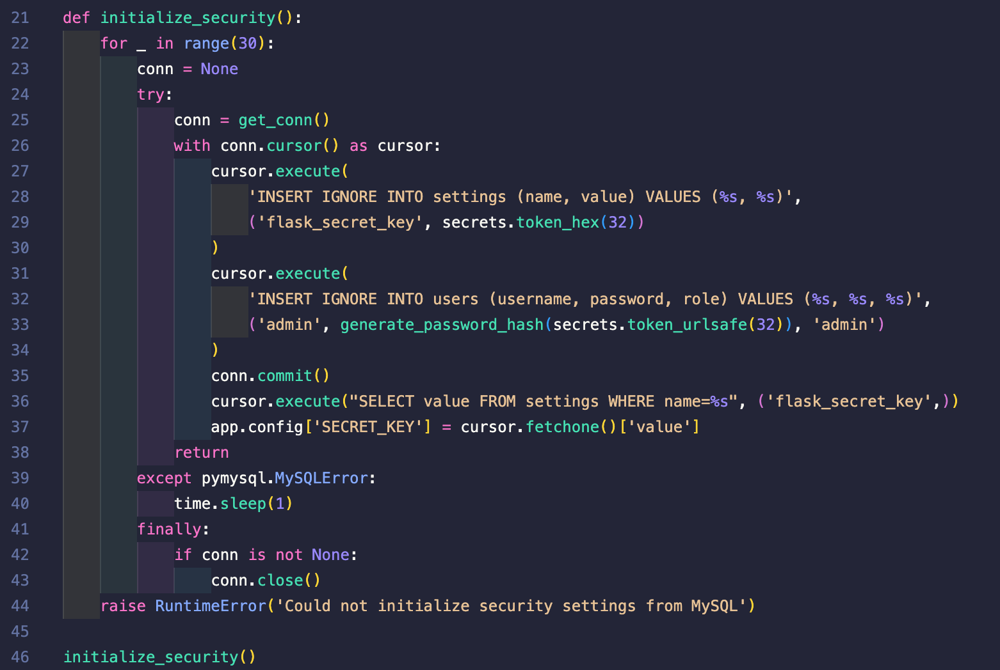
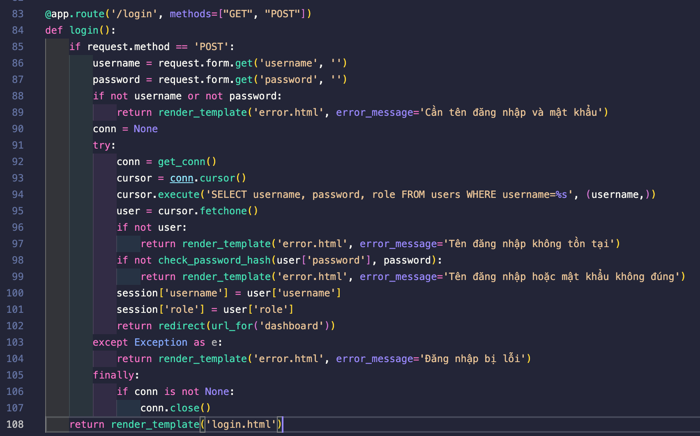
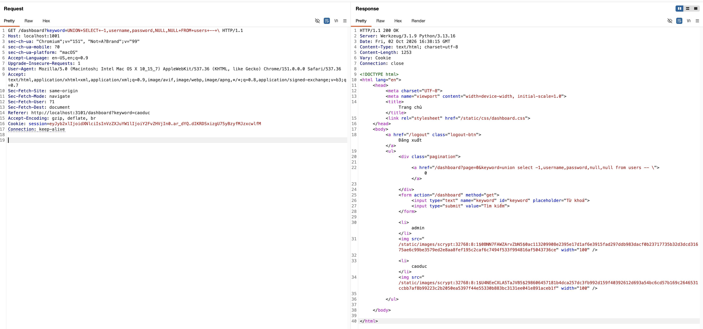
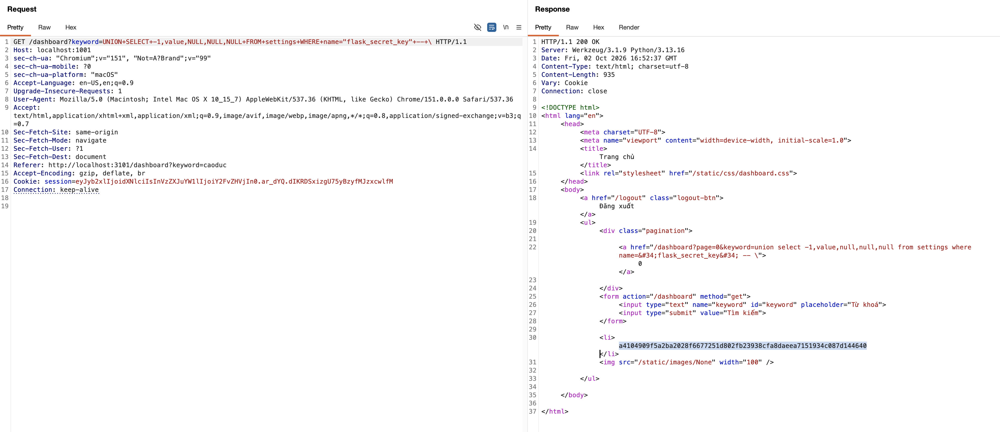
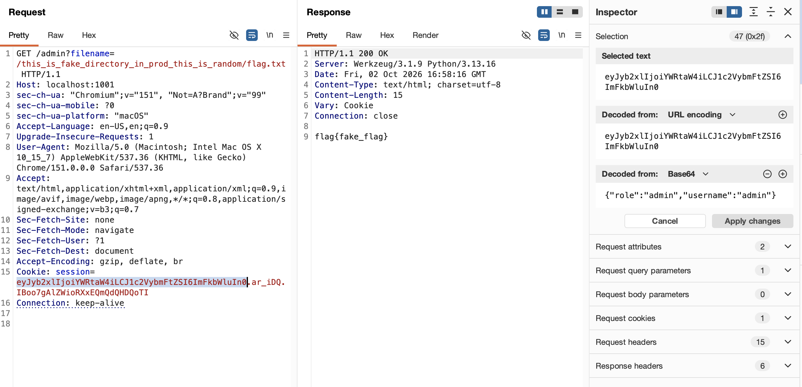

# Wannanime Rewind

| Competition | aochinh26 training |
| ----------- | ------------------ |
| Category    | Web Exploitation   |

## Overview

> Chúng ta được cung cấp 1 ứng dụng tra cứu và tìm kiếm các bộ phim hoạt hình Nhật Bản, mục tiêu là truy cập được vào `/admin` và đọc được file chứa flag

## Solution

Đọc phần phía trước ở: [Wannanime](../wannanime/writeup.md)

Ở phiên bản Rewind, challenge có một vài thay đổi khiến exploit chain cũ không còn dùng trực tiếp được.



Đầu tiên, tài khoản `admin` không còn được insert vào database với raw password nữa. Thay vào đó, password được sinh ngẫu nhiên bằng `secrets.token_urlsafe(32)` rồi lưu dưới dạng hash.



Cơ chế login cũng đã được sửa lại. Ứng dụng truy vấn user theo `username`, sau đó dùng `check_password_hash` để kiểm tra password người dùng nhập vào với hash đang lưu trong database. Điều này đồng nghĩa là nếu ta muốn đăng nhập với tài khoản admin thông qua route `/login`, ta bắt buộc phải biết password thật.

Nếu tiếp tục dùng SQL Injection để leak thông tin admin như challenge trước, ta chỉ lấy được hash của `password`.



Như ảnh trên, ta chỉ leak được hash của `password` và không thể dùng nó để đăng nhập trực tiếp. Phương án bruteforce để tìm password gần như bất khả thi vì password được sinh ngẫu nhiên.

Tuy nhiên, nhìn lại hàm `initialize_security()`, ta thấy có điểm đáng chú ý ở các dòng `27-30` và `36-37`:

```python
# 27-30
cursor.execute(
    'INSERT IGNORE INTO settings (name, value) VALUES (%s, %s)',
    ('flask_secret_key', secrets.token_hex(32))
)

# 36-37
cursor.execute("SELECT value FROM settings WHERE name=%s", ('flask_secret_key',))
app.config['SECRET_KEY'] = cursor.fetchone()['value']
```

Ở dòng `27-30`, ứng dụng insert vào bảng `settings` cặp key-value `flask_secret_key` với một secret ngẫu nhiên được sinh bằng `secrets.token_hex(32)`.

Sau đó dòng `36-37` sử dụng chính chuỗi đó để làm Flask secret key. Từ đây, ta có ý tưởng tận dụng SQL Injection để leak `flask_secret_key`, sau đó dùng secret key này để ký một Flask session cookie giả mạo và truy cập `/admin`.

Để đọc `flask_secret_key`, ta dùng payload:

```sql
UNION SELECT -1, value, NULL, NULL, NULL FROM settings WHERE name="flask_secret_key" -- \
```



Từ secret key vừa lấy được, dùng `flask-unsign` để ký một Flask session cookie mới với `username` và `role` là `admin`.

```bash
$ flask-unsign --sign --cookie '{"role": "admin", "username": "admin"}' --secret 'a4104909f5a2ba2028f6677251d802fb23938cfa8daeea7151934c087d144640'
eyJyb2xlIjoiYWRtaW4iLCJ1c2VybmFtZSI6ImFkbWluIn0.ar_iDQ.IBoo7gAlZWioRXxEQmQdQHDQoTI
```

Dùng cookie vừa ký được để truy cập `/admin`, sau đó khai thác lỗi đọc file bằng absolute path để lấy flag.



### Full Exploit Chain

Như vậy, toàn bộ exploit chain của ta như sau:

1. Đăng nhập bằng tài khoản user thường để truy cập `/dashboard`.

2. Khai thác SQL Injection qua tham số `keyword` để leak `flask_secret_key` từ bảng `settings`.

3. Dùng `flask_secret_key` để ký Flask session cookie với `username=admin`.

4. Dùng cookie giả mạo truy cập `/admin`, sau đó đọc flag bằng absolute path qua tham số `filename`.
