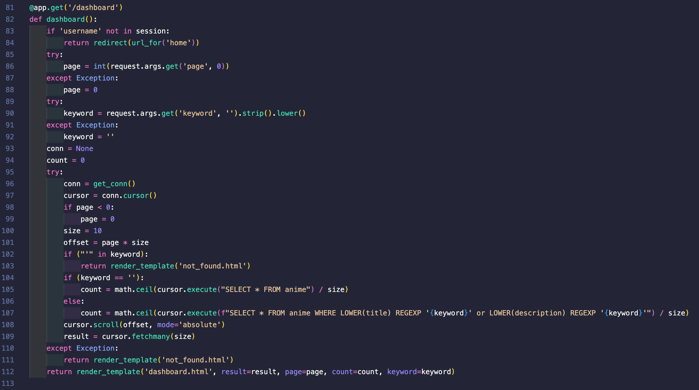
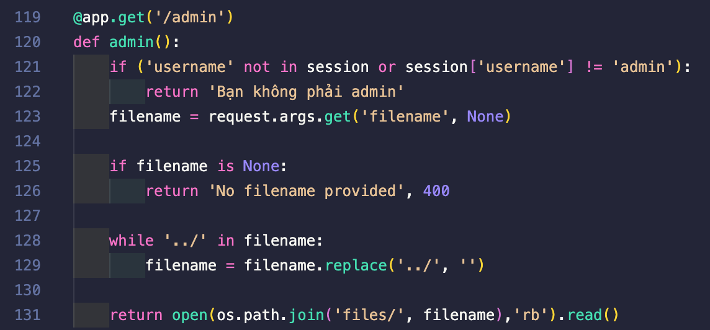
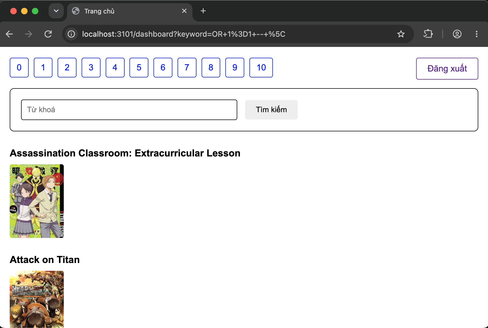
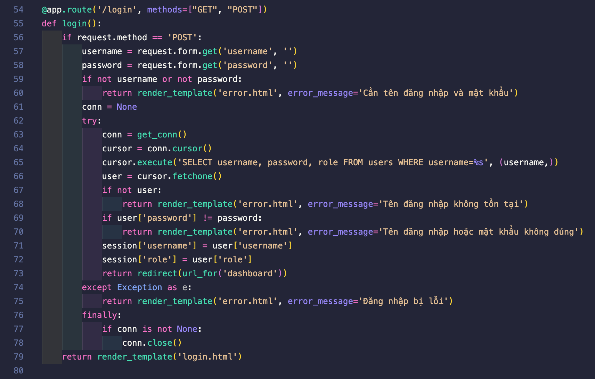
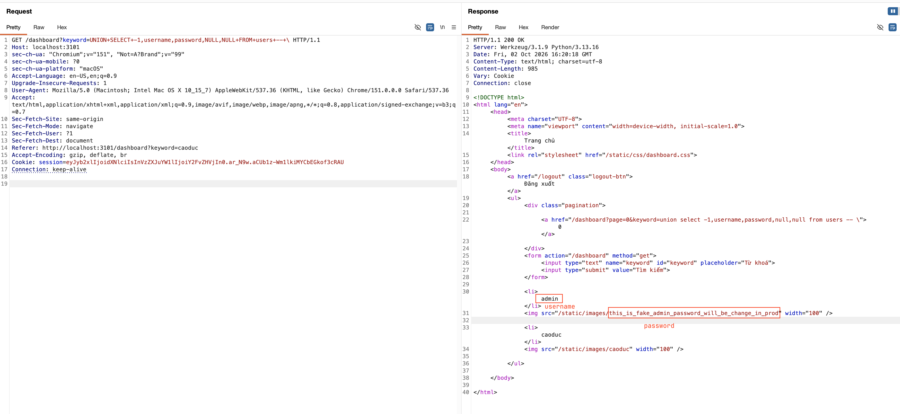
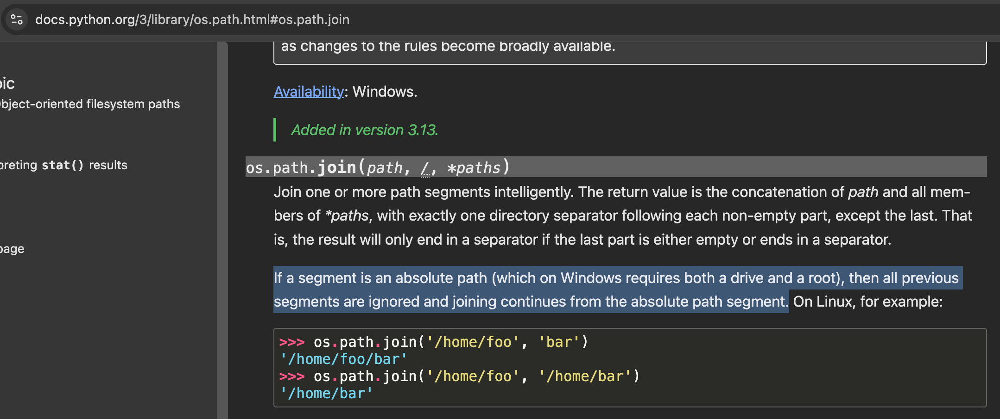
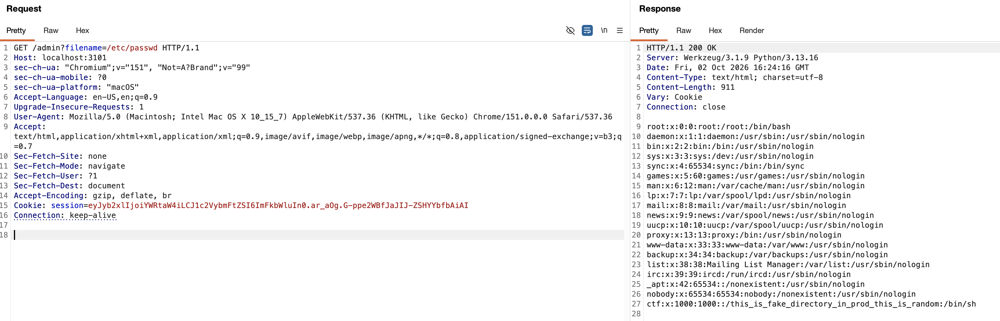
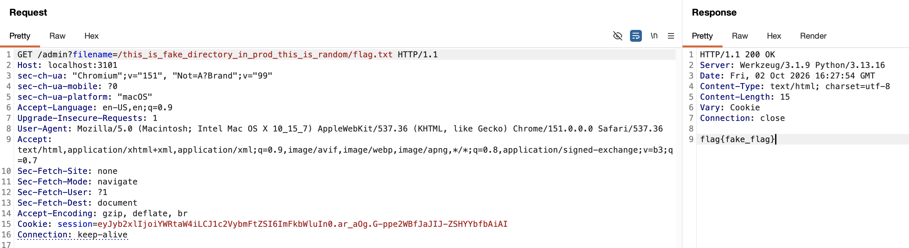

# Wannanime

| Competition | aochinh26 training |
| ----------- | ------------------ |
| Category    | Web Exploitation   |

## Overview

> Chúng ta được cung cấp 1 ứng dụng tra cứu và tìm kiếm các bộ phim hoạt hình Nhật Bản, mục tiêu là truy cập được vào `/admin` và đọc được file chứa flag

## Solution

Khi đọc qua codebase, ta thấy hai route đáng chú ý là `/dashboard` và `/admin`.



Route `/dashboard` xử lý chức năng tìm kiếm anime. Ở hầu hết các route khác, dữ liệu từ user được đưa vào câu truy vấn thông qua parameterized query. Tuy nhiên, tại dòng 107, tham số `keyword` lại được nối trực tiếp vào câu SQL bằng f-string:

```python
cursor.execute(f"SELECT * FROM anime WHERE LOWER(title) REGEXP '{keyword}' or LOWER(description) REGEXP '{keyword}'")
```

Mặc dù ứng dụng có chặn ký tự `'`, cách xử lý này vẫn là một dấu hiệu đáng nghi vì dữ liệu do user kiểm soát được nhúng trực tiếp vào truy vấn SQL. Đây là vị trí ta cần kiểm tra khả năng SQL Injection.



Ở route `/admin`, ứng dụng lấy `filename` trực tiếp từ request rồi dùng để đọc file:

```python
return open(os.path.join('files/', filename),'rb').read()
```

Dù dòng `128-129` có lọc chuỗi `../`, cơ chế lọc này chưa đủ chặt. Đặc biệt, nếu truyền vào một đường dẫn tuyệt đối, `os.path.join('files/', filename)` có thể bỏ qua thư mục `files/` ban đầu. Vì vậy route này có khả năng dẫn đến path traversal/LFI.

```dockerfile
FROM python:3.13

WORKDIR /app
ARG directory=/this_is_fake_directory_in_prod_this_is_random

COPY requirements.txt .
RUN pip install -r requirements.txt

RUN mkdir ${directory}
RUN useradd -M -d ${directory} ctf

COPY . .
RUN mv flag.txt ${directory}/flag.txt

RUN chown -R root:ctf ${directory}
RUN chmod -R 750 ${directory}

USER ctf
EXPOSE 5000
CMD ["python3", "app.py"]
```

Từ `app/Dockerfile`, ta biết flag được chuyển vào `/this_is_fake_directory_in_prod_this_is_random/flag.txt`. Vì vậy hướng khai thác là: trước tiên tìm cách truy cập được `/admin`, sau đó lợi dụng chức năng đọc file của route này để đọc flag.

### SQL Injection

Câu truy vấn SQL của route `/dashboard` là:

```sql
SELECT * FROM anime WHERE LOWER(title) REGEXP '{keyword}' or LOWER(description) REGEXP '{keyword}'
```

Trong câu truy vấn trên có tất cả 4 ký tự `'` nên ta đánh số luôn các ký tự này từ 1 đến 4, theo thứ tự từ trái qua phải.
Có thể thấy cặp (1, 2) và cặp (3, 4) cùng tạo thành 1 cặp dấu nháy bao quanh `keyword`.

Vì ứng dụng chặn ký tự `'`, ta không thể đóng chuỗi SQL theo cách thông thường để chèn thêm mệnh đề tùy ý. Tuy nhiên, filter này vẫn chưa đủ an toàn do MySQL mặc định cho phép dùng backslash để escape ký tự trong string literal.

Giả sử `keyword` kết thúc bằng dấu `\`, câu truy vấn sẽ có dạng:

```sql
SELECT * FROM anime WHERE LOWER(title) REGEXP '\' or LOWER(description) REGEXP '\'
```

Ở đây, dấu `\` trong lần xuất hiện đầu tiên của `keyword` sẽ escape dấu nháy số 2. Do đó, phần `or LOWER(description) REGEXP` bị “nuốt” vào string literal, và dấu nháy số 3 trở thành dấu đóng chuỗi. Sau dấu nháy số 3, lần xuất hiện thứ hai của `keyword` sẽ nằm ngoài string literal và được MySQL parse như một phần
của câu truy vấn.

Từ đó, ta có thể xây dựng payload theo dạng:

```
{sql injection payload} -- \
```

Trong đó dấu `\` ở cuối dùng để escape dấu nháy đóng của lần xuất hiện đầu tiên, còn `-- \` dùng để comment phần dấu nháy còn lại phía sau payload.

Ta thử ý tưởng với payload `OR 1=1 -- \`. Nếu payload này thành công, web sẽ trả về đầy đủ các bộ anime.



Như vậy là đã thành công, câu truy vấn lúc này sẽ có dạng như sau:

```sql
SELECT * FROM anime WHERE LOWER(title) REGEXP 'OR 1=1 -- \' or LOWER(description) REGEXP 'OR 1=1 -- \'
```

Tiếp theo, ta tìm cách tận dụng SQL Injection để truy cập được vào `/admin`.



Dựa vào logic code của route `/login`, ta thấy rằng `username` và `password` được lưu ở dạng raw text trong database, như vậy ta có thể sử dụng SQL Injection để leak ra được `password` của admin.

Vì challenge này là whitebox nên ta có thể đọc luôn source để biết xem là table của câu truy vấn ở `/dashboard` có bao nhiêu cột, trong lúc làm lab này thì mình luyện tay nên là mình chơi blackbox database luôn, bruteforce từng số lượng cột. Để leak được `admin` account thì ta dùng payload:

```
UNION SELECT -1, username, password, NULL, NULL FROM users -- \
```



Dùng `username` và `password` leak được, ta có thể truy cập vào `/admin`

### Path traversal/LFI

Sau khi vào được `/admin`, ta thấy route này đọc file dựa trên tham số `filename` do user truyền vào. Ứng dụng có cố gắng loại bỏ chuỗi `../`, nhưng cách xử lý này không đủ an toàn và vẫn bị path traversal vì cách xử lý đường dẫn của hàm `os.path.join('files/', filename)`.



Theo tài liệu Python, khi `os.path.join` gặp một path segment là absolute path, các segment đứng trước nó sẽ bị bỏ qua và việc join sẽ tiếp tục từ absolute path đó.

Áp dụng vào code của route `/admin`:

```python
os.path.join('files/', filename)
```

Nếu `filename=/etc/passwd`, kết quả sẽ tương đương với `/etc/passwd`, chứ không còn nằm trong thư mục `files/` nữa.

Do đó, ta không cần bypass bằng `../`. Chỉ cần truyền một absolute path qua tham số `filename` là có thể đọc file ngoài thư mục `files/`.

Thử với `/etc/passwd`:



Response trả về nội dung `/etc/passwd`, chứng minh ta đã đọc được file tùy ý trên filesystem.

Cuối cùng, ta đọc flag bằng absolute path:



### Full Exploit Chain

Như vậy, toàn bộ exploit chain của ta như sau:

1. Đăng nhập bằng một tài khoản user thường để truy cập `/dashboard`, sau đó khai thác SQL Injection qua tham số `keyword`.

2. Dùng `UNION SELECT` để leak username/password của admin từ bảng `users`.

    ```sql
    UNION SELECT -1, username, password, NULL, NULL FROM users -- \
    ```

3. Đăng nhập admin, vào `/admin` và đọc flag bằng absolute path qua tham số `filename`.

    ```http
    GET /admin?filename=/this_is_fake_directory_in_prod_this_is_random/flag.txt
    ```
