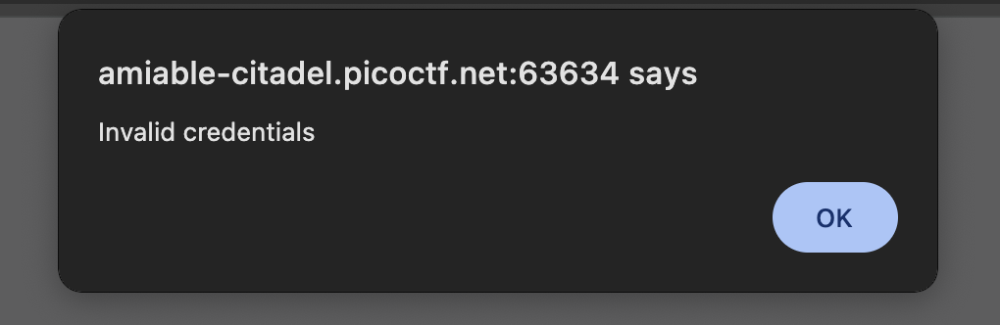
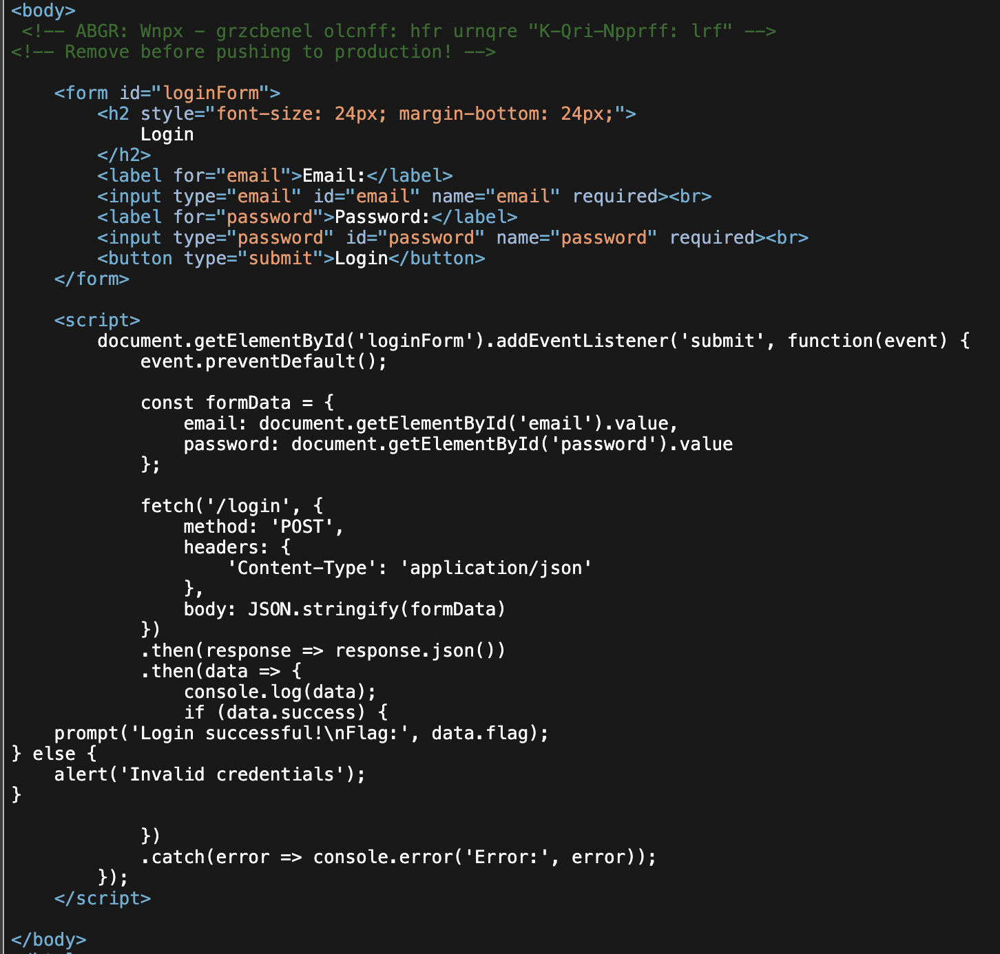
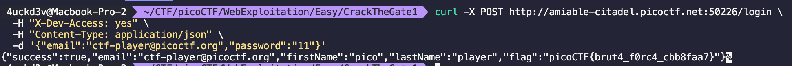

# Crack the Gate 1

**Author:** 4uckd3v  
**Date:** 2026-02-06  
**CTF / Platform:** picoCTF
**Category:** Web
**Difficulty:** Easy

---

## Summary

Find a way to bypass the login page of a website using a secret gateway that the developer forgot to remove.

---

## Challenge Information

- **Official Description:**

> We're in the middle of an investigation. One of our persons of interest, ctf player, is believed to be hiding sensitive data inside a restricted web portal. We've uncovered the email address he uses to log in: ctf-player@picoctf.org. Unfortunately, we don't know the password, and the usual guessing techniques haven't worked. But something feels off... it's almost like the developer left a secret way in. Can you figure it out?

---

## Analysis

When accessing the provided website, we see a login page with two input fields: `Email` and `Password`.


Attempting to log in with the email ctf-player@picoctf.org and several common passwords all fail.



Looking at the page source code, we find two suspicious commented lines.



The unusual comments, combined with the note "Remove before pushing to production!", suggest that the developer forgot to remove these lines before deploying to production. The first commented line appears to be some form of encoding, resembling a **Caesar Cipher**.

After some trial and error testing various shift values, I was able to decode the first line as:

```
NOTE: Jack - temporary byspass: use header "X-Dev-Access: yes"
```

Sending a request with the header `X-Dev-Access: yes` successfully bypasses the login page and retrieves the flag.

---

## Exploit

Send a POST request to the `/login` endpoint with the header `X-Dev-Access: yes` to bypass authentication. The password value is irrelevant since the header allows bypass.

**Using curl:**

```bash
curl -X POST [TARGET_URL] \
  -H "X-Dev-Access: yes" \
  -H "Content-Type: application/json" \
  -d '{"email":"ctf-player@picoctf.org","password":"11"}'
```

---

## Proof / Screenshots



---

## Vulnerability Explanation

The developer left commented-out credentials and a special header hint in the source code before deploying to production.

- **Root cause:** Hardcoded credentials and debug hints left in production code
- **How it works:** The developer encoded a note containing a special header (`X-Dev-Access: yes`) that bypasses authentication
- **Why it's exploitable:** The source code is accessible to users, revealing the secret bypass mechanism

---

## Mitigation

- Remove all debug comments, credentials, and hints before deploying to production
- Use environment variables for sensitive configuration instead of hardcoding
- Implement proper input validation and authentication checks that cannot be bypassed by headers
- Use code review processes to catch secrets and debug code before deployment
- Enable SAST (Static Application Security Testing) tools to detect hardcoded secrets

---

## Lessons Learned

- Always sanitize code before pushing to production
- Never leave debug credentials or authentication bypass mechanisms in deployed code
- Source code inspection is a valuable reconnaissance technique in web security
- Simple encoding (like Caesar Cipher) provides no real security

---

## References

- Caesar Cipher: https://en.wikipedia.org/wiki/Caesar_cipher
