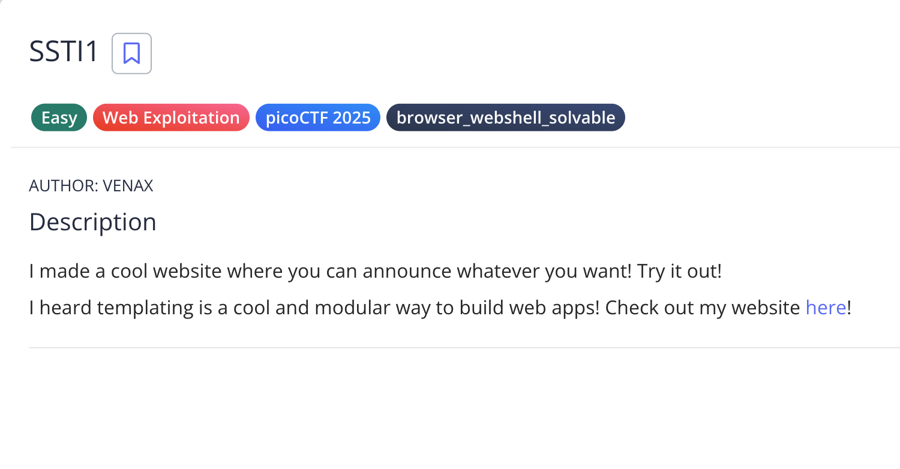
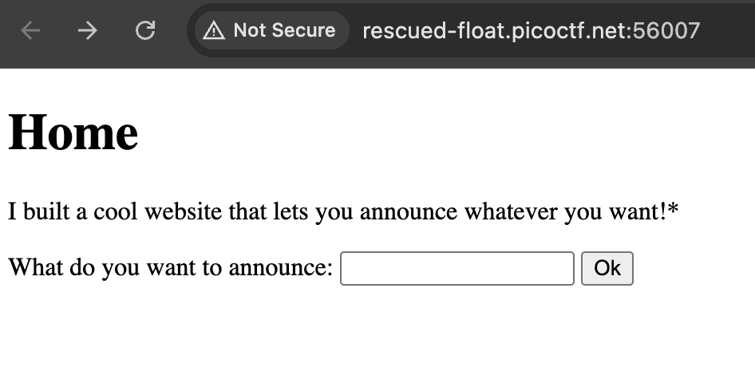
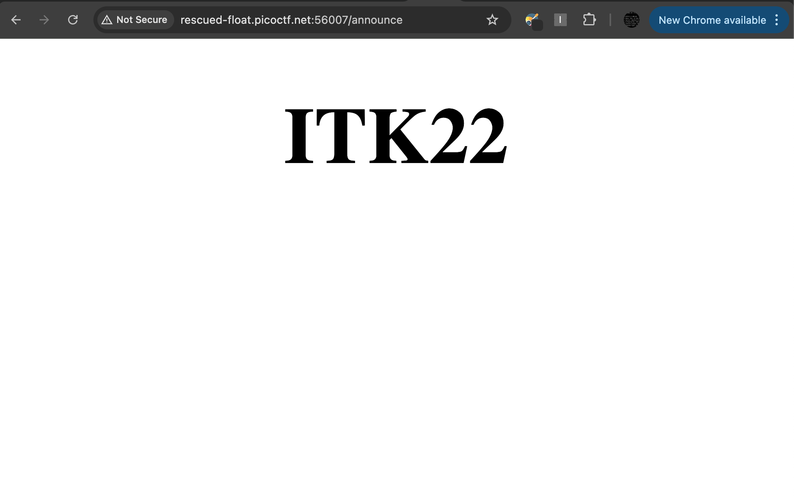
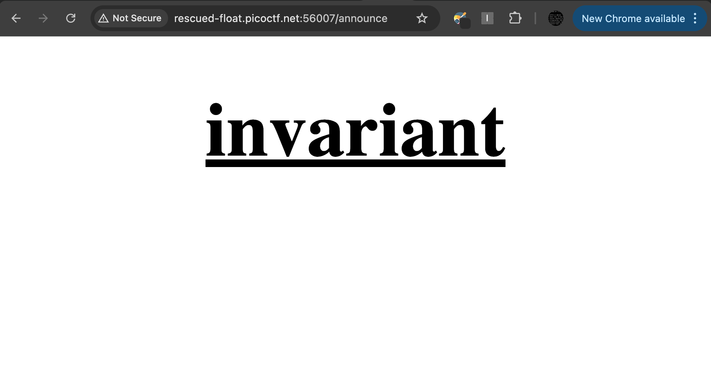
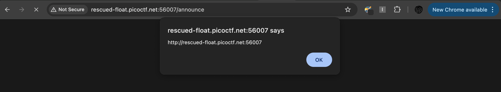
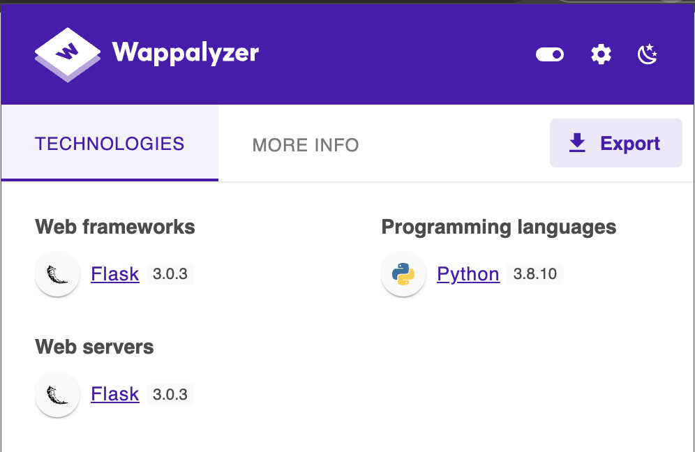
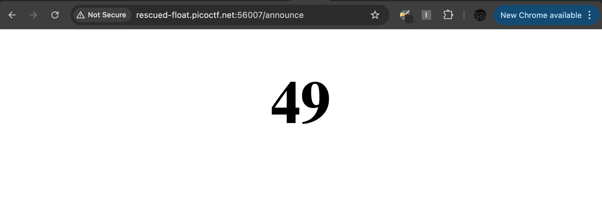
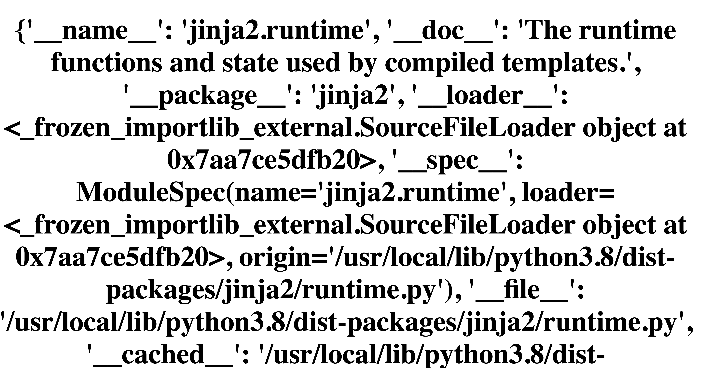
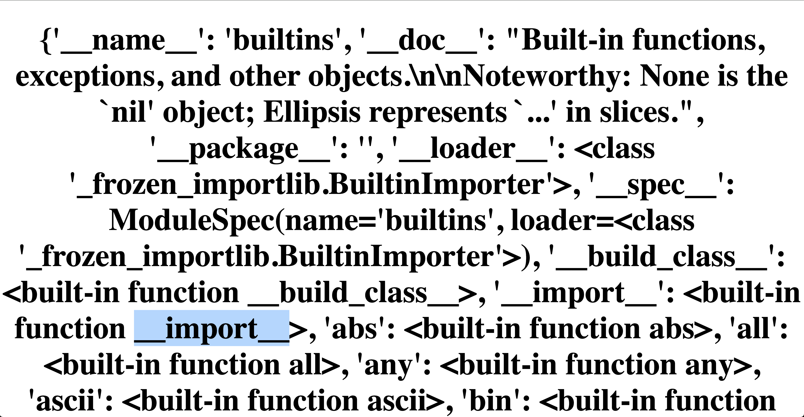
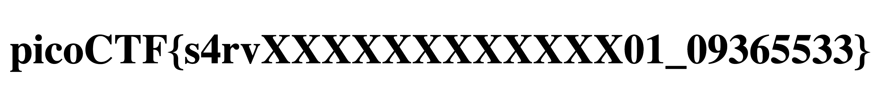

# SSTI1

**Tác giả:** 4uckd3v

**Date:** 2026-02-06

**CTF / Platform:** picoCTF

**Thể loại:** Web

**Độ khó:** Dễ

---

## Tóm tắt ngắn gọn

Khai thác lỗ hỏng Server-Side Template Injection (SSTI) ở tính năng tạo thông báo của website để chiếm quyền điều khiển máy chủ (RCE).

---

## Thông tin challenge



---

## Phân tích

Website của challenge trông có vẻ khá đơn giản, chỉ có 1 field để nhập thông báo của người dùng.



Giờ mình cứ test trước các tính năng như user bình thường cái đã, mình sẽ nhập thử chuỗi bất kỳ để xem website sẽ làm gì tiếp theo.



Sau khi nhập `ITK22` và submit thì mình được locate đến endpoint: `/announce`, trình duyệt render ra đoạn text mà mình đã nhập.

Ok, đến đây thì mình hiểu cơ bản là tính năng announce này sẽ render lại đoạn text mà user nhập vào. Giờ mình sẽ brainstorm một số hướng đi tiếp theo.

### Ý tưởng 1: HTML Injection

Với hành vi render input của user như vậy, cái đầu tiên mình nghĩ đến là HTML Injection, mình sẽ thử kiểm chứng ý tưởng này bằng payload đơn giản sau: `<u>invariant</u>`.



Như vậy là mình đã inject thành công HTML tag vào trang này, có vẻ như server không có cơ chế **HTML Sanitization**?

### Ý tưởng 2: Cross-Site Scripting (XSS)

Sau khi đã thực hiện được HTML Injection thì mình nghĩ ngay đến chủng lỗi bảo mật kinh điển, là hệ quả của HTML Injection. Đó chính là **XSS**.
Mình tiếp tục kiểm chứng ý tưởng bằng payload XSS đơn giản sau: `<script>alert(origin)</script>`



Payload trên vẫn hoạt động, như vậy trang này có khả năng cao bị dính XSS (mình chưa khẳng định 100% vì có thể các keyword khác bị filter).

Nhưng thật ra thì tới đây thì mình không nghĩ ra được exploit-chain nào cả, XSS là lỗ hỏng ở phía **Client-Side** nhưng website này lại quá đơn giản, không có gì để khai thác ở phía Client.

### Ý tưởng 3: Server-Side Template Injection (SSTI)

Bí quá nên mình đi đọc, nhìn lại xung quanh, vô tình lại thấy điểm bất thường ngay trong tên challenge. Trong khi các challenge khác thì thường mang tên có nghĩa (ví dụ: IntroToBurp, Boorkmarklet,... ) thì challenge này tên khá ngắn gọn và trông có vẻ giống viết tắt.
Mình thử Google luôn cụm `SSTI` thì nó hiện lên các kết quả đều nói về: **Server-Side Template Injection**. Nghe tên là thấy luôn là loại lỗi này xảy ra ở phía **Server-Side** rồi, đây là một loại lỗi liên quan đến cách máy chủ xử lý các **Template Engine**.

Nhưng có rất nhiều loại Template Engine khác nhau, mỗi loại lại có cú pháp khác nhau nên ta phải đi xác định challenge này dùng loại nào đã.



Dùng Wappalyzer thì mình biết được Server được chạy bằng Flask, một framework của Python. Đoạn này thì mình search ngay các Template Engine hay đi chung với Flask.
Mình biết được có một Template Engine tên là **Jinja**, là Template Engine mặc định của Flask, nên mình sẽ thử tìm một số payload SSTI của engine này để test luôn. (Thật ra thì chưa chắc lúc nào Flask cũng dùng **Jinja** nhưng ở đây thì mình cứ test trước, không được thì mình tìm engine khác).

Mình sẽ test với payload kinh điển: `{{7 * 7}}`, nếu server render ra 49 thì có thể xác định là trang này bị dính SSTI.



Ở đây thì mình biết là nó đã bị injection và Engine thực thi biểu thức `7 * 7`, bây giờ mình sẽ tìm hiểu xem là có những cách nào để RCE con web này.
Mình muốn gọi đến các hàm như `system`, `exec`,... nên đã test thử một vài payload sử dụng các hàm đó, tuy nhiên kết quả trả về cho thấy là các thư viện như `os`, `sys` không được import.
Hướng đi bây giờ của mình là mình sẽ thử tìm cách import các thư viện đó vào, sau một hồi hỏi **Gemini** thì mình biết được Python có cơ chế **Object Inheritance Introspection**, cơ chế này cho phép chúng ta truy cập vào không gian biến toàn cục của ứng dụng để tìm kiếm các hàm nguy hiểm. Giải thích thì hơi dài nên mọi người có thể tự tìm hiểu về cơ chế này <(").

Mình sẽ kiểm tra lại xem có phải chính xác Engine của server là Jinja không với payload: `{{ self.__init__ }}`



Tiếp theo, mình sẽ đi kiểm tra xem có builtin function/method nào cho phép mình import thư viện tuỳ ý hay không bằng payload: `{{ self.__init__.__globals__.__builtins__ }}`



Như vậy là ta có thể dùng hàm `import` để import các thư viện cần thiết cho việc thiết kế các phương án RCE.

---

## Khai thác

### Ý tưởng chính

Để khai thác SSTI, ta cần:

1. **Xác định Template Engine:** Đã xác định là Jinja (Flask mặc định)
2. **Tìm cách import thư viện:** Sử dụng `__builtins__.__import__()` để import `os`
3. **Thực thi command:** Sử dụng `os.popen()` để thực thi shell command

### Payload khai thác

```jinja2
# Liệt kê thư mục hiện tại để lấy tên flag
{{ self.__init__.__globals__.__builtins__.__import__('os').popen('ls -la').read() }}

# Đọc nội dung flag
{{ self.__init__.__globals__.__builtins__.__import__('os').popen('cat [FILE_NAME]').read() }}
```

### Các bước thực thi

1. Truy cập trang web `/announce`
2. Nhập payload vào field announce
3. Submit form
4. Xem kết quả output trên trang

### Flag

- 

---

## Giải thích lỗ hổng

### Root cause

Lỗ hỏng SSTI xảy ra vì:

1. **Không kiểm tra / lọc input của user:** Server chấp nhận input trực tiếp từ user mà không có bất kỳ cơ chế validation hay sanitization nào.
2. **Template Engine xử lý input unsanitized:** Jinja Template Engine sẽ phân tích cú pháp template `{{ ... }}` từ input của user.
3. **Cho phép truy cập global objects:** Jinja không hạn chế việc truy cập vào các object toàn cục như `__globals__`, `__builtins__`, v.v., điều này cho phép attacker có thể gọi các hàm nguy hiểm.

### Điều kiện khai thác

- Input của user được đưa vào template Jinja mà không được sanitize.
- Jinja được cấu hình với chế độ mặc định (không có cơ chế Sandbox).

---

## Bài học

- **SSTI là một lỗ hỏng nguy hiểm:** Nó có thể dẫn trực tiếp đến RCE, không cần phải chain với các lỗ hỏng khác.
- **Luôn validate & sanitize user input:** Đặc biệt khi input được sử dụng trong các Template Engine.
- **Template Engine security:** Cần hiểu rõ về cách hoạt động và các rủi ro bảo mật của từng Template Engine.
- **Object Introspection trong Python:** Python cho phép truy cập vào các attribute / method ẩn thông qua các attribute đặc biệt như `__globals__`, `__builtins__`, điều này có thể được khai thác nếu không được hạn chế.

---

## Tài liệu tham khảo

- [PortSwigger - Server-side template injection](https://portswigger.net/web-security/server-side-template-injection)
- [PayloadAllTheThings - Server Side Template Injection](https://github.com/swisskyrepo/PayloadsAllTheThings/tree/master/Server%20Side%20Template%20Injection)
- [Jinja Documentation](https://jinja.palletsprojects.com/)
- [Python Built-in Functions Documentation](https://docs.python.org/3/library/functions.html)

---
